# CSS (Cascading Style Sheets)

CSS stands for Cascading Style Sheets. It is a stylesheet language used to describe the presentation of a document written in HTML or XML (including XML dialects such as SVG or XHTML). CSS describes how elements should be rendered on screen, on paper, in speech, or on other media.

#### Basic Syntax

A CSS rule consists of a selector and a declaration block:

```css
selector {
    property: value;
}
```

- **Selector**: Targets the HTML element you want to style.
- **Property**: Specifies which aspect of the element you want to style (e.g., `color`, `font-size`).
- **Value**: Specifies the value for the property (e.g., `red`, `16px`).

#### Example

```css
/* Targeting all <p> elements */
p {
    color: blue;
    font-size: 16px;
}
```

### Cascading in CSS

Cascading is one of the fundamental principles of CSS, and it stands for the order of importance or precedence when multiple styles are applied to the same element.

#### Cascading Order

The CSS cascade works based on the following order of importance:

1. **Inline Styles**: Styles applied directly to an HTML element using the `style` attribute.
2. **Internal Styles**: Styles defined inside a `<style>` element within the `<head>` section of an HTML document.
3. **External Styles**: Styles defined in an external CSS file linked to the HTML document.
4. **Browser Default Styles**: Default styles provided by the web browser.

#### Specificity

Specificity is another crucial concept related to cascading. It determines which CSS rule is applied to an element when multiple conflicting rules exist.

The specificity of a CSS rule is calculated based on the following factors:

1. **Inline Styles**: Highest specificity.
2. **ID Selectors**: More specific than class selectors.
3. **Class Selectors**, **Attribute Selectors**, **Pseudo-classes**: Less specific than ID selectors but more than type selectors.
4. **Type Selectors**, **Pseudo-elements**: Least specific.

#### Example

```html
<!DOCTYPE html>
<html>
<head>
    <title>CSS Cascading Example</title>
    <style>
        /* Internal Style */
        p {
            color: red;
        }

        /* ID Selector */
        #specialParagraph {
            color: blue;
        }

        /* Class Selector */
        .highlight {
            color: green;
        }
    </style>
</head>
<body>

<!-- Inline Style -->
<p style="color: orange;">This is an inline style.</p>

<!-- ID Selector -->
<p id="specialParagraph">This is a paragraph with an ID.</p>

<!-- Class Selector -->
<p class="highlight">This is a paragraph with a class.</p>

<!-- Default Browser Style -->
<p>This is a default paragraph.</p>

</body>
</html>
```

In this example:

- The paragraph with inline style will have `color: orange;`.
- The paragraph with ID `specialParagraph` will have `color: blue;`.
- The paragraph with class `highlight` will have `color: green;`.
- The default paragraph will have `color: red;` due to the internal style.

Understanding the cascading and specificity rules is essential for effectively styling web pages and avoiding unintended style conflicts.

<br/>
<br/>
<br/>

## Ways of applying CSS 
 
CSS can be applied to HTML documents in several ways. Each method has its own use cases and advantages. Here are the common ways to apply CSS:

### 1. Inline Styles

Inline styles are applied directly to individual HTML elements using the `style` attribute.

```html
<p style="color: blue; font-size: 16px;">This is a paragraph with inline styles.</p>
```

**Advantages**:
- Quick and straightforward for individual styling.
- No need for external files or additional selectors.

**Disadvantages**:
- Not recommended for larger projects due to maintainability issues.
- Overrides other styles due to higher specificity.

### 2. Internal Styles

Internal styles are defined within a `<style>` element in the `<head>` section of an HTML document.

```html
<!DOCTYPE html>
<html>
<head>
    <title>Internal Styles</title>
    <style>
        p {
            color: red;
            font-size: 16px;
        }
    </style>
</head>
<body>
    <p>This is a paragraph with internal styles.</p>
</body>
</html>
```

**Advantages**:
- Better maintainability compared to inline styles.
- Styles can be applied to multiple elements or classes.

**Disadvantages**:
- Limited to a single HTML document.
- May still override other styles due to specificity.

### 3. External Styles

External styles are defined in separate CSS files and linked to HTML documents using the `<link>` element.

**styles.css**
```css
p {
    color: green;
    font-size: 18px;
}
```

**index.html**
```html
<!DOCTYPE html>
<html>
<head>
    <title>External Styles</title>
    <link rel="stylesheet" href="styles.css">
</head>
<body>
    <p>This is a paragraph with external styles.</p>
</body>
</html>
```

**Advantages**:
- Best for larger projects and multiple HTML pages.
- Enhances maintainability by separating content and presentation.
- Browser caching can improve page load performance for returning visitors.

**Disadvantages**:
- Requires an additional HTTP request for the CSS file.
- Potential for unused styles if not managed properly.

### 4. CSS Frameworks

CSS frameworks like Bootstrap, Foundation, and Tailwind CSS provide pre-built styles and components to help developers build responsive and consistent web designs more quickly.

**Bootstrap Example**
```html
<!DOCTYPE html>
<html>
<head>
    <title>Bootstrap Example</title>
    <link rel="stylesheet" href="https://maxcdn.bootstrapcdn.com/bootstrap/4.5.2/css/bootstrap.min.css">
</head>
<body>
    <div class="container">
        <p class="text-primary">This is a paragraph styled with Bootstrap.</p>
    </div>
</body>
</html>
```

**Advantages**:
- Speeds up development with pre-designed components.
- Responsive designs out of the box.
- Community support and extensive documentation.

**Disadvantages**:
- Can be bloated with unused styles if not customized carefully.
- May require additional learning curve for customization.

### Conclusion

Choosing the right method for applying CSS depends on the project requirements, scalability, and maintainability goals. For smaller projects or quick styling needs, inline or internal styles may suffice. However, for larger projects or professional web development, external styles or CSS frameworks are more suitable choices.

<br/>
<br/>
<br/>

# Colors in CSS 

Colors in CSS can be specified using various formats and methods to achieve the desired visual appearance of web elements. Let's explore the different ways to define colors in CSS in detail.

### 1. Named Colors

CSS supports a set of predefined color names which represent common colors.

```css
/* Using named colors */
p {
    color: red;
    background-color: yellow;
}
```

**Advantages**:
- Easy to remember and use.
- Clear intention for common colors.

**Disadvantages**:
- Limited to a specific set of colors.

### 2. Hexadecimal Colors

Hexadecimal colors are represented using a six-digit combination of numbers (0-9) and letters (A-F). They start with a `#` symbol.

```css
/* Using hexadecimal colors */
p {
    color: #FF0000; /* Red */
    background-color: #FFFF00; /* Yellow */
}
```

**Advantages**:
- Precise control over color shades.
- Commonly used in web design.

**Disadvantages**:
- Can be harder to remember or visualize compared to named colors.

### 3. RGB Colors

RGB (Red, Green, Blue) colors define a color in terms of its red, green, and blue components. Each component's value can range from 0 to 255.

```css
/* Using RGB colors */
p {
    color: rgb(255, 0, 0); /* Red */
    background-color: rgb(255, 255, 0); /* Yellow */
}
```

**Advantages**:
- Provides precise control over color mixing.
- Useful for creating custom colors.

**Disadvantages**:
- Requires more typing compared to other methods.

### 4. RGBA Colors

RGBA colors are similar to RGB but include an additional alpha channel to specify opacity. The alpha value ranges from 0 (completely transparent) to 1 (completely opaque).

```css
/* Using RGBA colors */
p {
    color: rgba(255, 0, 0, 0.5); /* Semi-transparent red */
    background-color: rgba(255, 255, 0, 0.7); /* Semi-transparent yellow */
}
```

**Advantages**:
- Allows for transparency effects.
- Useful for layering elements or creating subtle background effects.

**Disadvantages**:
- Older browsers may not support RGBA fully.

### 5. HSL and HSLA Colors

HSL (Hue, Saturation, Lightness) and HSLA (Hue, Saturation, Lightness, Alpha) provide another way to specify colors in CSS. HSL represents colors based on their hue, saturation, and lightness.

```css
/* Using HSL colors */
p {
    color: hsl(0, 100%, 50%); /* Red */
    background-color: hsl(60, 100%, 50%); /* Yellow */
}
```

**Advantages**:
- Intuitive way to select colors based on human perception.
- Easy to adjust hue, saturation, and lightness independently.

**Disadvantages**:
- Less commonly used compared to RGB and hexadecimal colors.

### Conclusion

Choosing the right color format depends on the design requirements and personal preference. While named colors are straightforward, hexadecimal and RGB/RGBA offer more flexibility and precision. HSL/HSLA can be beneficial for designers who prefer to work with color schemes based on hue, saturation, and lightness. It's essential to experiment with different color formats to find the most suitable approach for your projects.\

<br/>
<br/>
<br/>
<br/>

# **`Font size`** in CSS
Font size in CSS determines the size of text within HTML elements. It can be specified using various units to achieve the desired visual appearance on web pages. Here's an overview of different methods to set font size in CSS:

### 1. Absolute Units

Absolute units provide a fixed-size measurement for text.

#### Pixels (`px`)

Pixels are commonly used for setting a precise text size.

```css
p {
    font-size: 16px;
}
```

#### Points (`pt`)

Points are traditionally used for print stylesheets but can also be used for web design.

```css
p {
    font-size: 12pt;
}
```

#### Inches (`in`), Centimeters (`cm`)

These units are less common for web design due to their large size.

```css
p {
    font-size: 0.5in;
}
```

### 2. Relative Units

Relative units scale the font size relative to other elements.

#### Em (`em`)

The `em` unit sets the font size relative to the font size of the parent element.

```css
p {
    font-size: 1.2em; /* 1.2 times the parent's font size */
}
```

#### Rem (`rem`)

The `rem` unit sets the font size relative to the root element's font size.

```css
p {
    font-size: 1.5rem; /* 1.5 times the root font size */
}
```

#### Percentages (`%`)

Percentages set the font size relative to the parent element's font size.

```css
p {
    font-size: 150%; /* 150% of the parent's font size */
}
```

### 3. Viewport Units

Viewport units are relative to the viewport size.

#### VH (`vh`)

```css
p {
    font-size: 5vh; /* 5% of the viewport height */
}
```

#### VW (`vw`)

```css
p {
    font-size: 5vw; /* 5% of the viewport width */
}
```

### Conclusion

Choosing the right font size unit depends on the design requirements and the desired responsiveness of the website. While absolute units offer precise control over text size, relative units and viewport units provide scalability across different devices and screen sizes. It's essential to consider the overall design and accessibility needs when determining the appropriate font size for web content.

<br/>
<br/>
<br/>

# Selectors in Detail
Selectors are a fundamental part of CSS that allow you to target and style specific HTML elements on a web page. Understanding selectors and their various types can greatly enhance your ability to style web content effectively. Let's dive into selectors in detail, along with some tricks to make your CSS more efficient and powerful.

### Basic Selectors

#### 1. Type Selectors

Target elements based on their HTML tag name.

```css
/* Target all <p> elements */
p {
    color: blue;
}
```

#### 2. Class Selectors

Target elements based on their `class` attribute.

```css
/* Target elements with class "highlight" */
.highlight {
    background-color: yellow;
}
```

#### 3. ID Selectors

Target elements based on their `id` attribute.

```css
/* Target the element with id "header" */
#header {
    font-size: 24px;
}
```

### Advanced Selectors

#### 1. Descendant Selector

Target elements that are descendants of a specific element.

```css
/* Target <span> elements inside <p> */
p span {
    font-weight: bold;
}
```

#### 2. Child Selector

Target direct children of an element.

```css
/* Target <li> elements that are direct children of <ul> */
ul > li {
    list-style-type: none;
}
```

#### 3. Adjacent Sibling Selector

Target an element that is immediately preceded by a specific sibling element.

```css
/* Target the <p> immediately preceded by an <h2> */
h2 + p {
    margin-top: 0;
}
```

#### 4. General Sibling Selector

Target elements that share the same parent and come after a specific element.

```css
/* Target <p> elements that come after an <h2> */
h2 ~ p {
    color: gray;
}
```

### Pseudo-classes and Pseudo-elements

#### 1. Pseudo-classes

Apply styles based on element states or positions.

```css
/* Target the first child of an <li> element */
li:first-child {
    font-weight: bold;
}
```

#### 2. Pseudo-elements

Style specific parts of an element.

```css
/* Add a double border to the first letter of a <p> */
p::first-letter {
    border: 2px double black;
    padding: 4px;
}
```

### CSS Selectors Tricks

#### 1. Grouping Selectors

Combine multiple selectors to apply the same styles to multiple elements.

```css
/* Apply the same styles to <h1>, <h2>, and <h3> */
h1, h2, h3 {
    font-family: Arial, sans-serif;
}
```

#### 2. Attribute Selectors

Target elements based on their attribute values.

```css
/* Target <a> elements with a "target" attribute */
a[target="_blank"] {
    color: red;
}
```

#### 3. :not() Pseudo-class

Exclude specific elements from a selector.

```css
/* Target all <li> elements except the first one */
li:not(:first-child) {
    margin-top: 10px;
}
```

#### 4. :nth-child() Pseudo-class

Select elements based on their position within a parent.

```css
/* Target every even <tr> element */
tr:nth-child(even) {
    background-color: #f2f2f2;
}
```

### Conclusion

Mastering CSS selectors and understanding their intricacies can significantly improve your web styling skills. By leveraging various types of selectors, pseudo-classes, and pseudo-elements, you can create complex and responsive designs with ease. Using selector tricks and advanced techniques, you can write cleaner, more efficient CSS code that is easier to maintain and understand. Experiment with different selectors and practice regularly to become proficient in selecting and styling web elements effectively.

<br/>
<br/>
<br/>

# Universal Selector 

The universal selector in CSS is denoted by an asterisk `*`. It matches any element type and is used to target all elements in the document. While the universal selector can be powerful, it should be used judiciously due to its broad nature, which can potentially affect performance and override other more specific styles.

### Syntax

```css
* {
    /* styles */
}
```

### Usage

#### 1. Setting Global Styles

The universal selector can be used to set default styles for all elements, providing a consistent baseline.

```css
* {
    margin: 0;
    padding: 0;
    box-sizing: border-box;
}
```

#### 2. Resetting Browser Styles

To ensure consistent styles across different browsers, developers often use a CSS reset or normalize.css. The universal selector can be helpful in resetting browser-specific styles.

```css
* {
    margin: 0;
    padding: 0;
}
```

#### 3. Applying Base Styles

You can apply base styles to all elements before adding more specific styles to individual elements or classes.

```css
* {
    font-family: Arial, sans-serif;
    color: #333;
}
```

### Considerations

While the universal selector can be handy, it's essential to be cautious when using it:

1. **Performance**: Applying styles to all elements can impact performance, especially on larger web pages.

2. **Specificity**: Styles applied using the universal selector have low specificity. This means they can be easily overridden by more specific selectors, causing unexpected styling issues.

3. **Maintenance**: Using the universal selector for global styles can make the CSS harder to maintain and debug, as changes can unintentionally affect various parts of the website.

### Best Practices

1. **Use Sparingly**: Limit the use of the universal selector to reset or base styles. Avoid using it to apply specific styles that can be targeted more efficiently using other selectors.

2. **Combine with Other Selectors**: Instead of relying solely on the universal selector, combine it with other selectors to target specific elements more precisely.

3. **Be Aware of Specificity**: Always be mindful of CSS specificity when using the universal selector to ensure styles are applied as intended.

### Conclusion

While the universal selector can be a useful tool in CSS, it's crucial to use it wisely to avoid unintended styling and performance issues. By understanding its capabilities and limitations, you can leverage the universal selector effectively in combination with other selectors to create well-structured and maintainable CSS code for your web projects.

<br/>
<br/>
<br/>

# Body tag selector vs universal selector
Both the `body` tag selector and the universal selector (`*`) serve distinct purposes in CSS, and understanding when and how to use them can help you write more efficient and maintainable stylesheets. Let's compare these two selectors and their typical uses.

### Body Tag Selector (`body`)

The `body` selector targets the `<body>` element of an HTML document. It's used to apply styles specifically to the entire document body.

**Example:**

```css
body {
    font-family: Arial, sans-serif;
    background-color: #f4f4f4;
    color: #333;
}
```

#### Advantages:

1. **Specificity**: The `body` selector has higher specificity compared to the universal selector. This means its styles are less likely to be overridden by other selectors, making it more reliable for setting global styles.

2. **Clarity**: Using the `body` selector clearly indicates that the styles are intended for the entire document body, making the CSS easier to understand and maintain.

3. **Performance**: Since it targets only the `<body>` element, it's more efficient than the universal selector when you want to apply styles to the entire document.

### Universal Selector (`*`)

The universal selector matches any element in the HTML document. It's a wildcard selector that applies styles globally across all elements.

**Example:**

```css
* {
    margin: 0;
    padding: 0;
    box-sizing: border-box;
}
```

#### Advantages:

1. **Global Reset**: The universal selector is commonly used for CSS resets or to set baseline styles that are applied to all elements, providing a consistent starting point across different browsers.

2. **Base Styles**: It can be used to apply base styles to all elements before adding more specific styles to individual elements or classes.

3. **Consistency**: Ensures that no default browser styles interfere with your custom styles, leading to more predictable styling across different browsers.

### When to Use Each Selector

- **Use `body` Selector When**: 
  - You want to set specific styles for the entire document body.
  - You need higher specificity to prevent style conflicts.
  - You want to make the CSS more readable by indicating that the styles are for the body.

- **Use Universal Selector When**: 
  - You're applying a global reset or baseline styles to all elements.
  - You want to ensure consistent styles across different browsers.
  - You're building a framework or library that requires a consistent starting point for styles.

### Conclusion

While both the `body` tag selector and the universal selector have their uses, they serve different purposes in CSS:

- Use the `body` selector for setting styles specifically for the entire document body, providing higher specificity and clarity.
  
- Use the universal selector for global resets or baseline styles to ensure consistency across browsers and to apply initial styles to all elements.

By understanding the differences and appropriate use-cases for each selector, you can write cleaner, more efficient CSS that is easier to maintain and debug.

<br/>
<br/>
<br/>
<br/>

# Class Selector 

The class selector in CSS is used to target HTML elements based on their `class` attribute. This allows you to apply specific styles to multiple elements across your web page without having to repeat the styles for each individual element. Class selectors provide a way to style elements that share common characteristics or styles.

### Syntax

The class selector starts with a dot `.` followed by the class name.

```css
/* Class selector */
.className {
    /* styles */
}
```

### HTML Example

To apply a class to an HTML element, you use the `class` attribute:

```html
<!-- HTML Element with Class -->
<div class="className">This is a div with a class</div>
```

### Multiple Classes

An HTML element can have multiple classes separated by spaces. This allows you to combine styles from different classes.

```html
<div class="className1 className2">This div has multiple classes</div>
```

### Usage

#### 1. Single Class Selector

Target elements with a specific class.

```css
/* Target elements with class "highlight" */
.highlight {
    background-color: yellow;
    color: black;
}
```

#### 2. Multiple Class Selector

Target elements that have multiple classes.

```css
/* Target elements with both "highlight" and "bold-text" classes */
.highlight.bold-text {
    font-weight: bold;
}
```

#### 3. Descendant Class Selector

Target child elements with a specific class.

```css
/* Target <span> elements inside elements with class "highlight" */
.highlight span {
    font-style: italic;
}
```

### Advantages of Class Selectors

1. **Reusability**: Classes allow you to apply the same styles to multiple elements without duplicating code.
  
2. **Specificity**: Class selectors have a higher specificity compared to tag selectors, making them useful for applying more specific styles.

3. **Semantics**: Classes provide semantic meaning, making the HTML more descriptive and easier to understand.

### Best Practices

1. **Descriptive Names**: Use descriptive class names that reflect the purpose or function of the styled element.

2. **Use with Other Selectors**: Combine class selectors with other selectors for more targeted styling.

3. **Avoid Overusing IDs**: While IDs have high specificity, they are less reusable than classes. Reserve IDs for unique elements and use classes for reusable styles.

### Conclusion

Class selectors are a powerful feature in CSS that allow you to apply reusable styles to multiple elements in your HTML document. By using meaningful class names and combining class selectors with other selectors, you can create well-organized, maintainable, and scalable stylesheets for your web projects.

<br/>
<br/>
<br/>

# ID Selector 

The ID selector in CSS is used to target a single, unique HTML element based on its `id` attribute. Unlike class selectors, which can be applied to multiple elements, an ID selector targets a specific element with a unique identifier. Each `id` attribute value within a page must be unique to maintain valid HTML.

### Syntax

The ID selector starts with a hash `#` followed by the `id` value of the element.

```css
/* ID Selector */
#myId {
    /* styles */
}
```

### HTML Example

To assign an ID to an HTML element, you use the `id` attribute:

```html
<!-- HTML Element with ID -->
<div id="myId">This is a div with an ID</div>
```

### Usage

#### Single ID Selector

Target a specific element with a unique ID.

```css
/* Target element with ID "header" */
#header {
    background-color: #333;
    color: white;
}
```

### Advantages of ID Selectors

1. **High Specificity**: ID selectors have the highest specificity in CSS, making them powerful for overriding styles.

2. **Unique Identification**: IDs are unique within a document, ensuring that the styles are applied to a single, specific element.

3. **Fast Lookup**: Browsers can quickly identify and apply styles based on ID selectors due to their unique nature.

### Best Practices

1. **Use Sparingly**: IDs should be used for unique elements that require specific, one-off styling. Avoid using IDs for styling purposes when a class would suffice.

2. **Semantic Meaning**: Use descriptive ID names that reflect the purpose of the element, enhancing readability and understanding.

3. **Avoid Styling in HTML**: While it's possible to apply styles directly within the `style` attribute using the `id` selector, it's generally recommended to keep styles in external or internal stylesheets for better maintainability.

### Comparison with Class Selectors

- **Uniqueness**: IDs must be unique within a page, whereas classes can be applied to multiple elements.
  
- **Specificity**: IDs have higher specificity than classes, making them useful for overriding styles when necessary.

- **Reusability**: Classes are more reusable and flexible than IDs since they can be applied to multiple elements.

### Conclusion

ID selectors offer a powerful way to target and style specific elements in your HTML documents. While they provide high specificity and are useful for unique elements, it's essential to use IDs judiciously and reserve them for elements that truly require unique styling or functionality. By combining ID and class selectors strategically, you can create well-structured and maintainable CSS for your web projects.

<br/>
<br/>

# Attribute selector and selector list

In CSS, attribute selectors allow you to target HTML elements based on their attributes and attribute values. They provide a way to style elements that match specific attribute criteria, offering more flexibility in selecting elements compared to just tag names, classes, or IDs.

### Attribute Selector

#### Syntax

```css
/* Attribute Selector */
selector[attribute=value] {
    /* styles */
}
```

#### Examples

1. **Attribute Exists**

```css
/* Target all <a> elements with a "href" attribute */
a[href] {
    color: blue;
}
```

2. **Attribute Equals a Specific Value**

```css
/* Target all <input> elements with type="checkbox" */
input[type="checkbox"] {
    margin-right: 10px;
}
```

3. **Attribute Contains a Specific Value**

```css
/* Target all elements with a "class" attribute containing "active" */
[class*="active"] {
    background-color: yellow;
}
```

4. **Attribute Starts with a Specific Value**

```css
/* Target all  elements with a "src" attribute starting with "https://" */
img[src^="https://"] {
    border: 1px solid green;
}
```

5. **Attribute Ends with a Specific Value**

```css
/* Target all <a> elements with a "href" attribute ending with ".pdf" */
a[href$=".pdf"] {
    color: red;
}
```

### Selector List

#### Syntax

You can combine multiple selectors into a comma-separated list to apply the same styles to multiple selectors.

```css
/* Selector List */
selector1, selector2, selector3 {
    /* styles */
}
```

#### Examples

1. **Multiple Tag Names**

```css
/* Apply styles to <h1>, <h2>, and <h3> elements */
h1, h2, h3 {
    font-family: Arial, sans-serif;
}
```

2. **Multiple Classes**

```css
/* Apply styles to elements with class "btn-primary" and "btn-secondary" */
.btn-primary, .btn-secondary {
    padding: 10px;
    border-radius: 5px;
}
```

3. **Combining Selectors**

```css
/* Apply styles to <a> elements with a "target" attribute and elements with class "btn" */
a[target], .btn {
    text-decoration: none;
}
```

### Conclusion

Attribute selectors and selector lists are powerful features in CSS that allow you to target and style elements based on various criteria, including attributes, tag names, classes, and IDs. By understanding and using these selectors effectively, you can create more dynamic, flexible, and maintainable stylesheets for your web projects. Experiment with different attribute selector patterns and selector combinations to leverage their full potential in your CSS styling.

<br/>
<br/>
<br/>

# Advanced CSS Selectors and Combinators

In CSS, combinators are used to combine selectors in various ways to target specific elements within the document tree. Combinators help you create more complex and specific selectors to style elements based on their relationship to other elements.

### 1. Descendant Combinator (` `)

The descendant combinator selects all elements that are descendants of a specified ancestor.

```css
/* Select all <span> elements inside <div> elements */
div span {
    color: blue;
}
```

### 2. Child Combinator (`>`)

The child combinator selects direct children of a specified parent element.

```css
/* Select all <li> elements that are direct children of <ul> */
ul > li {
    list-style-type: none;
}
```

### 3. Adjacent Sibling Combinator (`+`)

The adjacent sibling combinator selects an element that is immediately preceded by a specified sibling element.

```css
/* Select the first <p> element immediately preceded by an <h2> */
h2 + p {
    font-weight: bold;
}
```

### 4. General Sibling Combinator (`~`)

The general sibling combinator selects all elements that are siblings of a specified element.

```css
/* Select all <p> elements that are siblings of an <h2> */
h2 ~ p {
    color: gray;
}
```

### 5. Combinator List

You can combine multiple combinators to create complex selectors.

```css
/* Select <li> elements that are descendants of <ul> and are not the first child */
ul > li:not(:first-child) {
    margin-top: 10px;
}
```

### Conclusion

Understanding and using CSS combinators allow you to create more targeted and specific selectors, which can be particularly useful for complex styling requirements. By leveraging descendant, child, adjacent, general sibling, and combinator lists, you can craft precise selectors that accurately target the elements you want to style. Experimenting with these combinators and understanding their behavior will enhance your CSS skills and enable you to create more dynamic and responsive web designs.

<br/>
<br/>

# Understanding **`Pseudo-classes`** and **`Pseudo-elements`** in CSS

Pseudo-classes and pseudo-elements are powerful features in CSS that allow you to style elements based on various states and parts of an element, respectively. These selectors provide additional flexibility and control over styling, enabling you to create dynamic and interactive web designs.

#### Pseudo-classes

Pseudo-classes target elements based on their state or position in the document tree, such as `:hover`, `:focus`, `:first-child`, and `:nth-child`.

##### Common Pseudo-classes

1. **`:hover`**

   Targets an element when it's being hovered over.

   ```css
   /* Style the button on hover */
   button:hover {
       background-color: #007bff;
       color: white;
   }
   ```

2. **`:focus`**

   Targets an element when it receives focus, often used with form elements.

   ```css
   /* Style the input when focused */
   input:focus {
       border-color: #007bff;
       outline: none;
   }
   ```

3. **`:first-child`**

   Targets the first child element of a parent.

   ```css
   /* Style the first list item */
   li:first-child {
       font-weight: bold;
   }
   ```

4. **`:nth-child()`**

   Targets elements based on their position relative to their parent.

   ```css
   /* Style every other row in a table */
   tr:nth-child(even) {
       background-color: #f2f2f2;
   }
   ```

#### Pseudo-elements

Pseudo-elements target specific parts of an element, such as `::before`, `::after`, and `::first-line`.

##### Common Pseudo-elements

1. **`::before`**

   Inserts content before the content of an element.

   ```css
   /* Add a bullet point before each list item */
   li::before {
       content: "\2022";
       margin-right: 8px;
   }
   ```

2. **`::after`**

   Inserts content after the content of an element.

   ```css
   /* Add a link icon after each external link */
   a[href^="http"]::after {
       content: " (external link)";
   }
   ```

3. **`::first-line`**

   Targets the first line of text in a block-level element.

   ```css
   /* Style the first line of paragraphs */
   p::first-line {
       font-weight: bold;
       font-size: 120%;
   }
   ```

#### Combining Pseudo-classes and Pseudo-elements

You can combine pseudo-classes and pseudo-elements for more complex styling.

```css
/* Style the first letter of each paragraph */
p::first-letter {
    font-size: 150%;
    color: #007bff;
}

/* Style the first paragraph when hovered */
p:first-child:hover {
    background-color: #f2f2f2;
}
```

### Conclusion

Pseudo-classes and pseudo-elements offer versatile ways to target and style elements based on their states, positions, and specific parts. By understanding the various pseudo-classes and pseudo-elements and how to use them effectively, you can create more interactive, dynamic, and visually appealing web designs. Experiment with these selectors in your CSS to explore their full potential and enhance your web development skills.

<br/>
<br/>
<br/>

# Understanding the Difference: div:first-child vs div :first-child

In CSS, the spacing around the `:` (colon) in selectors matters. Let's break down the difference between `div:first-child` and `div :first-child`.

### 1. `div:first-child`

This selector targets a `div` element that is the first child of its parent.

```css
/* Targets a <div> element that is the first child of its parent */
div:first-child {
    background-color: #f2f2f2;
}
```

#### Example:

```html
<div>
    <div>First child</div>  <!-- This div will be targeted -->
    <p>Second child</p>
</div>
```

### 2. `div :first-child`

This selector targets the first child element inside a `div`, regardless of its type.

```css
/* Targets the first child element inside a <div>, regardless of its type */
div :first-child {
    color: blue;
}
```

#### Example:

```html
<div>
    <div> <!-- This div will not be targeted -->
        <span>First child element</span>  <!-- This span will be targeted -->
    </div>
    <p>Second child</p>
</div>
```

### Key Differences:

- **`div:first-child`**: Targets a `div` element itself that is the first child of its parent.
  
- **`div :first-child`**: Targets the first child element inside a `div`, which could be of any type (e.g., `div`, `p`, `span`, etc.).

### Conclusion:

Understanding the difference between these two selectors is crucial for precise CSS targeting. The spacing around the colon (`:`) significantly impacts the behavior and specificity of the selector. Always be mindful of the spacing and structure of your selectors to ensure you're targeting the desired elements accurately in your stylesheets.

<br/>
<br/>
<br/>

# The Comprehensive Guide to the CSS Box Model

The CSS Box Model is a foundational concept that defines the structure of web elements as rectangular boxes. Understanding the Box Model is crucial for creating well-structured and visually appealing layouts on web pages. Let's delve into each component of the Box Model in detail.

#### Components of the Box Model

The CSS Box Model consists of four main components:

1. **Content**
2. **Padding**
3. **Border**
4. **Margin**

#### 1. Content

The content area is where the actual content of the element, such as text, images, or other media, is displayed.

```css
/* Example: Define content width and height */
.box {
    width: 200px;
    height: 100px;
}
```

#### 2. Padding

Padding is the space between the content area and the element's border. It helps to create space within the box, separating the content from the border.

```css
/* Example: Set padding for the box */
.box {
    padding: 20px;
}
```

#### 3. Border

The border surrounds the padding and content areas, providing a visible boundary around the element. You can define the border width, style, and color.

```css
/* Example: Define border properties */
.box {
    border: 2px solid #333;
}
```

#### 4. Margin

Margin is the space outside the border of the element, creating space between the element and other elements on the page.

```css
/* Example: Set margin for the box */
.box {
    margin: 20px;
}
```

#### Visualization of the Box Model

Here's how the Box Model components fit together:

```
+----------------------------------------+
|                  Margin                |
|                                        |
|  +----------------------------------+  |
|  |              Border              |  |
|  |                                  |  |
|  |  +------------------------------+  |  |
|  |  |           Padding            |  |  |
|  |  |                              |  |  |
|  |  |  +------------------------+  |  |  |
|  |  |  |        Content         |  |  |  |
|  |  |  |                        |  |  |  |
|  |  |  +------------------------+  |  |  |
|  |  +------------------------------+  |  |
|  +------------------------------------+  |
+----------------------------------------+
```

#### Box Sizing

The `box-sizing` property allows you to control how the total width and height of an element are calculated, including or excluding padding and border.

```css
/* Example: Set box-sizing property */
.box {
    box-sizing: border-box; /* Includes padding and border in the total width and height */
}
```

#### Conclusion

Mastering the CSS Box Model is essential for web development, as it forms the basis for layout design and spacing control. By understanding and manipulating the content, padding, border, and margin of elements, you can create responsive and visually appealing web layouts. Experiment with these properties to gain a deeper understanding of the Box Model and enhance your CSS skills.

<br/>
<br/>
<br/>

# Understanding `content-box` vs `border-box` in the CSS Box Model

The `box-sizing` property in CSS allows you to control how the total width and height of an element are calculated. There are two main values for `box-sizing`: `content-box` and `border-box`. Let's explore the differences between these two values and their implications for layout design.

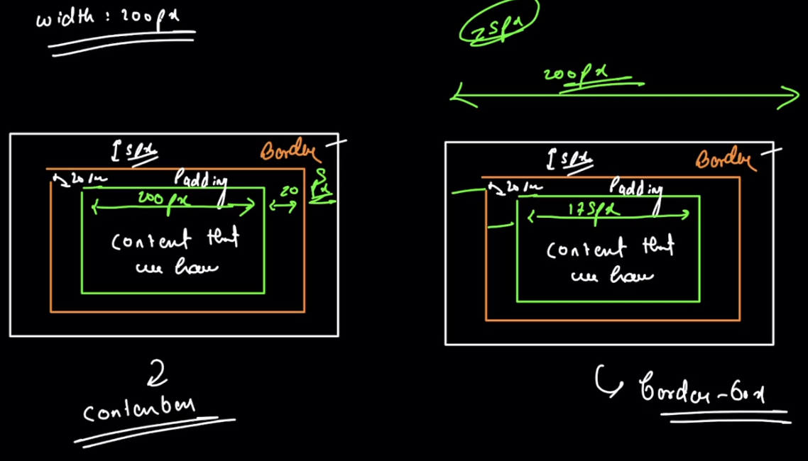

#### 1. `content-box`

When you use `box-sizing: content-box;`, the width and height of the element are calculated based only on the content area, excluding padding, border, and margin.

```css
/* Example: Using content-box */
.box {
    box-sizing: content-box;
    width: 200px;  /* Width is only for content area */
    padding: 20px; /* Additional space */
    border: 2px solid #333; /* Border */
}
```

In this example:

- **Width Calculation**: Width = content width (200px) + left padding (20px) + right padding (20px) + left border (2px) + right border (2px) = 244px
- **Height Calculation**: Height = content height (auto) + top padding (20px) + bottom padding (20px) + top border (2px) + bottom border (2px) = auto + 44px

#### 2. `border-box`

When you use `box-sizing: border-box;`, the width and height of the element include the content, padding, and border, but not the margin.

```css
/* Example: Using border-box */
.box {
    box-sizing: border-box;
    width: 200px;  /* Total width including content, padding, and border */
    padding: 20px; /* Padding */
    border: 2px solid #333; /* Border */
}
```

In this example:

- **Width Calculation**: Width = specified width (200px) 
- **Height Calculation**: Height = content height (auto)

With `border-box`, the padding and border are included in the specified width and height, making it easier to control the size of elements, especially in responsive design.

#### Comparison Table

| Property       | Content Width | Padding | Border | Margin | Total Width |
|----------------|--------------|---------|--------|--------|-------------|
| `content-box`  | Yes          | Yes     | Yes    | No     | Content + Padding + Border |
| `border-box`   | Yes          | No      | No     | No     | Specified Width/Height |

#### Conclusion

- **`content-box`**: Useful when you want to control the content size precisely and manage padding and border separately.
  
- **`border-box`**: Convenient for designing layouts, especially in responsive design, as it includes padding and border in the specified width and height.

Choosing between `content-box` and `border-box` depends on your specific layout requirements and design approach. Understanding these two values and their impact on the Box Model is essential for effective CSS styling and layout design.

<br/>
<br/>
<br/>

# Understanding `box-sizing: inherit;` in CSS

The `box-sizing: inherit;` property value allows an element to inherit the `box-sizing` value from its parent element. This means that the child element will use the `box-sizing` value set on its nearest ancestor instead of its default value.

#### Example:

Let's say you have a parent `div` with `box-sizing: border-box;` and a child `div` without any specific `box-sizing` value.

```css
/* Parent div */
.parent {
    box-sizing: border-box;
    width: 300px;
    padding: 20px;
    border: 2px solid #333;
}

/* Child div */
.child {
    box-sizing: inherit;
    width: 100%;  /* Inherits the border-box calculation from the parent */
    height: 100px;
}
```

In this example:

- The parent `div` has a `width` of `300px`, `padding` of `20px`, and `border` of `2px`. 
- The child `div` will inherit the `box-sizing: border-box;` from its parent.
- The `width` of the child `div` will be calculated as `300px` (`100%` of the parent's `300px` width), including the `padding` and `border`.

#### Visualization:

```
Parent div (border-box):
+--------------------------------------+
|  Padding (20px) | Content (260px) |  |
|                  |                  |  |
+--------------------------------------+
|                  Border (2px)        |
+--------------------------------------+
|                                      |
| Child div (inherits border-box)      |
|  Width: 100% (including padding and  |
|  border from parent)                 |
|  Height: 100px                       |
|                                      |
+--------------------------------------+
```

#### Key Points:

- **Inheritance**: The `box-sizing: inherit;` property value allows an element to inherit the `box-sizing` value from its parent.
  
- **Consistency**: Using `inherit` ensures consistency in the box-sizing model throughout nested elements, making it easier to manage layouts and maintain design integrity.

#### Conclusion:

The `box-sizing: inherit;` property value is a powerful tool that allows for consistent box-sizing behavior across nested elements. By leveraging inheritance, you can streamline your CSS and ensure that child elements adhere to the same box-sizing model as their parent, facilitating more predictable and maintainable layouts.

<br/>
<br/>
<br/>

# Exploring the `box-sizing` Trick in CSS

The CSS code snippet you provided is a commonly used trick to ensure consistent box-sizing behavior across all elements, including pseudo-elements like `::before` and `::after`. Let's break down the code and understand how it works.

```css
* {
    box-sizing: border-box;
}
```

#### `*` Selector with `box-sizing: border-box;`

This rule applies the `box-sizing: border-box;` property to all elements (`*`). When you set `box-sizing` to `border-box`, it includes padding and border in the total width and height of the elements, making it easier to manage layouts and maintain consistency.

```css
*, *:before, *:after {
    box-sizing: inherit;
}
```

#### `*, *:before, *:after` Selector with `box-sizing: inherit;`

This rule sets the `box-sizing` property of all elements, as well as their `::before` and `::after` pseudo-elements, to `inherit`. By using `inherit`, these elements will inherit the `box-sizing` value from their nearest ancestor, which, in this case, is the `*` selector with `box-sizing: border-box;`.

#### How It Works:

1. **Universal Selector (`*`)**: Sets the box-sizing property to `border-box` for all elements, including the root element.

2. **Pseudo-elements (`*:before` and `*:after`)**: Ensures that pseudo-elements inherit the box-sizing value from their corresponding elements.

3. **Inheritance**: Child elements will inherit the `border-box` box-sizing behavior from their parent elements due to the `box-sizing: inherit;` rule.

#### Benefits:

- **Consistency**: Ensures that all elements, including pseudo-elements, have consistent box-sizing behavior.
  
- **Simplicity**: Simplifies the management of layouts by using a consistent box-sizing model throughout the document.

#### Conclusion:

The `box-sizing` trick using `*` and `inherit` is a handy technique to establish a consistent box-sizing model across your entire website. It promotes simplicity, reduces layout inconsistencies, and facilitates easier maintenance of your CSS codebase. By implementing this trick, you can streamline your web development process and ensure a more predictable and manageable layout design.

<br/>
<br/>
<br/>

# Relating the `box-sizing` Trick to a Parent-Child Relationship

Imagine a scenario where a teacher encourages a student to participate in a school contest because it would be beneficial for the student's growth and learning experience. However, the student's father does not allow the child to participate due to various reasons.

#### The Analogy:

- **Teacher (Universal Selector `*` with `box-sizing: border-box;`)**: The teacher represents the universal selector that sets the `box-sizing` to `border-box` for all elements. Just like the teacher encourages the student to participate in the contest, the universal selector promotes a consistent `border-box` box-sizing model for all elements.

- **Child (Child Elements with `box-sizing: inherit;`)**: The child represents the individual elements on the webpage, and the student symbolizes each element's ability to inherit the box-sizing behavior from its parent.

- **Father (Parent Elements with `box-sizing: border-box;`)**: The father represents the parent elements that dictate the box-sizing behavior. Even though the teacher (universal selector) suggests participating in the contest, the child (element) ultimately follows the decision of the father (parent element).

#### The Connection:

- **Inheritance**: Just like the child follows the parent's decision in the contest scenario, the child elements in CSS inherit the `border-box` box-sizing behavior from their parent elements. The child elements trust and follow the decision of their parent, maintaining consistency and harmony within the family (CSS layout).

- **Consistency and Control**: The parent's decision provides a consistent guideline for the child, ensuring that the child's behavior aligns with the family's values and expectations. Similarly, setting a consistent `box-sizing` model ensures predictability and control over the layout design across the website.

#### Conclusion:

The analogy illustrates the relationship between parent and child elements in CSS and highlights the importance of inheritance in maintaining consistency and control. Just as children often follow their parents' decisions, child elements in CSS follow the box-sizing behavior set by their parent elements. This concept promotes harmony, consistency, and predictability in both family dynamics and web layouts, emphasizing the significance of understanding and leveraging inheritance in CSS design.

<br/>
<br/>
<br/>

# Mastering Flexbox: A Comprehensive Guide

Flexbox, or the Flexible Box Layout, is a powerful layout model in CSS that provides a more efficient way to design complex and responsive layouts. It offers a more predictable way to distribute space and align content within containers, making it easier to create dynamic and flexible designs. Let's dive into the details of Flexbox and explore its key concepts, properties, and practical examples.

#### What is Flexbox?

Flexbox is a one-dimensional layout method for laying out items in rows or columns. It allows you to design complex layouts and align content within containers, regardless of their size or dynamic changes.

#### Key Concepts

1. **Flex Container**: The parent element that contains flex items.
2. **Flex Items**: The children of a flex container that are laid out using Flexbox.
3. **Main Axis**: The primary axis along which flex items are laid out (horizontal or vertical).
4. **Cross Axis**: The perpendicular axis to the main axis (vertical or horizontal).

#### Flex Container Properties

1. **`display`**: Specifies the display type as `flex` to create a flex container.
   ```css
   .flex-container {
       display: flex;
   }
   ```

2. **`flex-direction`**: Defines the main axis direction (`row`, `row-reverse`, `column`, `column-reverse`).
   ```css
   .flex-container {
       flex-direction: row; /* Default value */
   }
   ```

3. **`flex-wrap`**: Controls whether flex items should wrap onto multiple lines or stay on a single line (`nowrap`, `wrap`, `wrap-reverse`).
   ```css
   .flex-container {
       flex-wrap: nowrap; /* Default value */
   }
   ```

4. **`justify-content`**: Aligns flex items along the main axis (`flex-start`, `flex-end`, `center`, `space-between`, `space-around`, `space-evenly`).
   ```css
   .flex-container {
       justify-content: center;
   }
   ```

5. **`align-items`**: Aligns flex items along the cross axis (`flex-start`, `flex-end`, `center`, `baseline`, `stretch`).
   ```css
   .flex-container {
       align-items: center;
   }
   ```

6. **`align-content`**: Controls the alignment of flex lines when there's extra space in the cross axis (`flex-start`, `flex-end`, `center`, `space-between`, `space-around`, `stretch`).
   ```css
   .flex-container {
       align-content: center;
   }
   ```

#### Flex Item Properties

1. **`order`**: Specifies the order of flex items.
   ```css
   .flex-item {
       order: 2;
   }
   ```

2. **`flex-grow`**: Determines how much a flex item will grow relative to other flex items.
   ```css
   .flex-item {
       flex-grow: 1; /* Default value */
   }
   ```

3. **`flex-shrink`**: Controls the shrinking behavior of flex items.
   ```css
   .flex-item {
       flex-shrink: 1; /* Default value */
   }
   ```

4. **`flex-basis`**: Specifies the initial size of a flex item.
   ```css
   .flex-item {
       flex-basis: auto; /* Default value */
   }
   ```

5. **`flex`**: A shorthand property for `flex-grow`, `flex-shrink`, and `flex-basis`.
   ```css
   .flex-item {
       flex: 1 1 auto; /* Default values */
   }
   ```

#### Practical Examples

1. **Basic Flexbox Layout**
   ```css
   .flex-container {
       display: flex;
       justify-content: space-between;
   }
   ```

2. **Centering Content**
   ```css
   .flex-container {
       display: flex;
       justify-content: center;
       align-items: center;
   }
   ```

3. **Responsive Flexbox Grid**
   ```css
   .flex-container {
       display: flex;
       flex-wrap: wrap;
   }
   
   .flex-item {
       flex: 1 1 calc(33.333% - 20px);
       margin: 10px;
   }
   ```

#### Conclusion

Flexbox offers a versatile and efficient way to design complex and responsive layouts with ease. By understanding and utilizing the various Flexbox properties and concepts, you can create dynamic and flexible designs that adapt to different screen sizes and devices. Experiment with Flexbox in your projects to explore its full potential and enhance your web development skills.

<br/>
<br/>
<br/>

### Understanding Flexbox: `flex-direction`, `flex-wrap`, and `flex-flow`

Flexbox provides a flexible way to design layouts and align content within containers, making it easier to create responsive and dynamic designs. Three key properties that control the behavior and layout of Flexbox are `flex-direction`, `flex-wrap`, and `flex-flow`. Let's explore each of these properties in detail.

#### 1. `flex-direction`

The `flex-direction` property specifies the direction of the main axis along which flex items are laid out within a flex container.

- **`row` (Default)**: Flex items are laid out horizontally, starting from the left side.

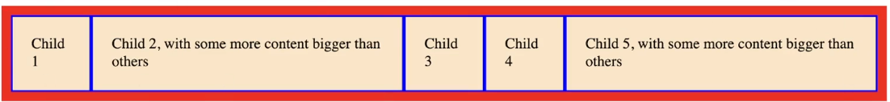
  
  ```css
  .flex-container {
      flex-direction: row;
  }
  ```

- **`row-reverse`**: Flex items are laid out horizontally, starting from the right side.
  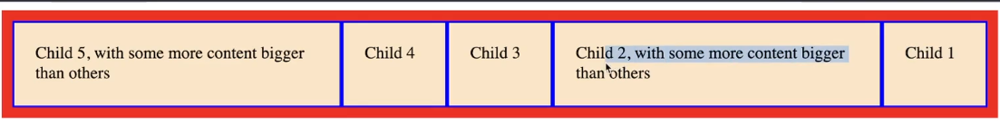
  ```css
  .flex-container {
      flex-direction: row-reverse;
  }
  ```

- **`column`**: Flex items are laid out vertically, starting from the top.
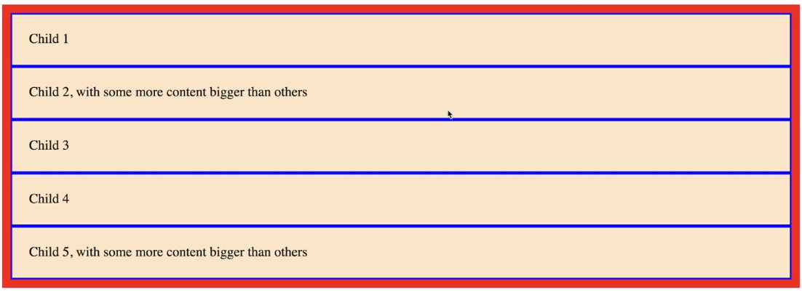
  
  ```css
  .flex-container {
      flex-direction: column;
  }
  ```

- **`column-reverse`**: Flex items are laid out vertically, starting from the bottom.
  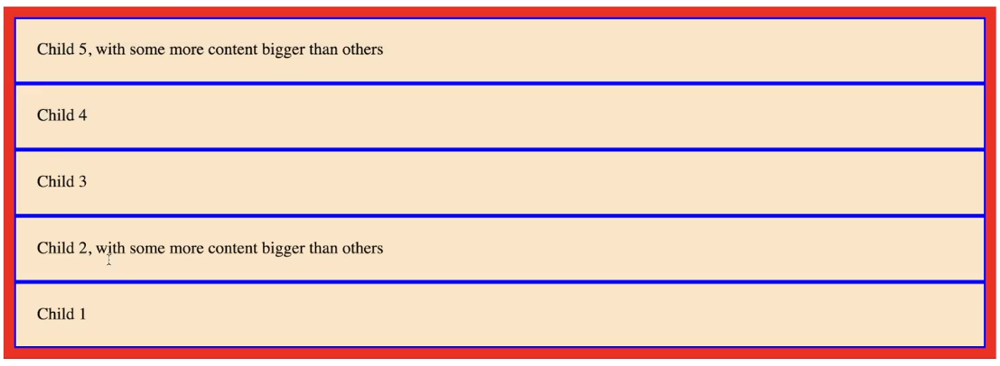
  ```css
  .flex-container {
      flex-direction: column-reverse;
  }
  ```

#### 2. `flex-wrap`

The `flex-wrap` property controls whether flex items should wrap onto multiple lines or stay on a single line within a flex container.

- **`nowrap` (Default)**: Flex items are laid out on a single line.
  
  ```css
  .flex-container {
      flex-wrap: nowrap;
  }
  ```

- **`wrap`**: Flex items wrap onto multiple lines from top to bottom.
  
  ```css
  .flex-container {
      flex-wrap: wrap;
  }
  ```

- **`wrap-reverse`**: Flex items wrap onto multiple lines from bottom to top.
  
  ```css
  .flex-container {
      flex-wrap: wrap-reverse;
  }
  ```

#### 3. `flex-flow`

The `flex-flow` property is a shorthand for setting both `flex-direction` and `flex-wrap` properties in a single declaration.
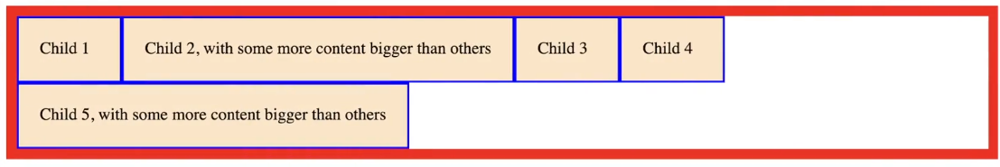
```css
.flex-container {
    flex-flow: row wrap; /* flex-direction and flex-wrap */
}
```

#### Examples

1. **Horizontal Layout with Wrapping**
   ```css
   .flex-container {
       flex-direction: row;
       flex-wrap: wrap;
   }
   ```

2. **Vertical Layout with Reversed Wrapping**
   ```css
   .flex-container {
       flex-direction: column-reverse;
       flex-wrap: wrap-reverse;
   }
   ```

3. **Shorthand for Row Layout with Wrapping**
   ```css
   .flex-container {
       flex-flow: row wrap;
   }
   ```

#### Conclusion

Understanding `flex-direction`, `flex-wrap`, and `flex-flow` is essential for mastering Flexbox layouts. These properties provide you with the flexibility to control the direction, wrapping behavior, and flow of flex items within containers, enabling you to create complex and responsive designs with ease. Experiment with these properties in your projects to explore the versatility and power of Flexbox and enhance your web development skills.

<br/>
<br/>
<br/>

# Exploring Flexbox Layout with CSS

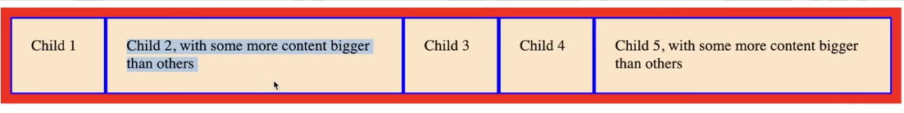

The provided CSS code snippet demonstrates a basic Flexbox layout setup using the `box-sizing` property and Flexbox properties. Let's break down the code and understand each part.

#### 1. `box-sizing` Reset

The `box-sizing` property ensures that padding and border are included in the element's total width and height, making it easier to manage layouts.

```css
html {
    box-sizing: border-box;
}
*, *:before, *:after {
    box-sizing: inherit;
}
```

- **`html`**: Sets the default `box-sizing` to `border-box` for the entire document.
- **`*`, `*:before`, `*:after`**: Inherit the `box-sizing` value from the `html` element, ensuring consistent box-sizing behavior for all elements and their pseudo-elements.

#### 2. Flex Container (`#parent`)

```css
#parent {
    border: solid red 10px;
    display: flex;
    flex-direction: row;
}
```

- **`border: solid red 10px;`**: Adds a solid red border with a thickness of `10px` to the `#parent` container.
- **`display: flex;`**: Turns the `#parent` into a Flexbox container.
- **`flex-direction: row;`**: Specifies the main axis direction as horizontal (`row`), meaning the child elements will be laid out in a row.

#### 3. Flex Items (`#parent div`)

```css
#parent div {
    border: solid ☐ blue 2px;
    padding: 20px;
    background-color: bisque;
    min-width: 100px;
}
```

- **`border: solid ☐ blue 2px;`**: Adds a solid blue border with a thickness of `2px` to each `div` inside the `#parent`.
- **`padding: 20px;`**: Provides `20px` padding around the content of each `div`.
- **`background-color: bisque;`**: Sets the background color of each `div` to bisque.
- **`min-width: 100px;`**: Specifies the minimum width of each `div` to `100px`, ensuring a minimum size for the flex items.

#### Visualization

```
#parent (Flex Container)
+------------------------------------+
|  +--------------+  +--------------+  |
|  |  Flex Item   |  |  Flex Item   |  |
|  +--------------+  +--------------+  |
+------------------------------------+
```

#### Conclusion

This Flexbox layout example demonstrates a simple row-based layout where the `#parent` container contains multiple `div` flex items. The `box-sizing` reset ensures consistent box-sizing behavior across all elements, while the Flexbox properties enable flexible and dynamic layout design. You can customize this basic setup further by adjusting the Flexbox properties and styles to meet your specific design requirements.

<br/>
<br/>
<br/>


## Flexbox Layout with CSS
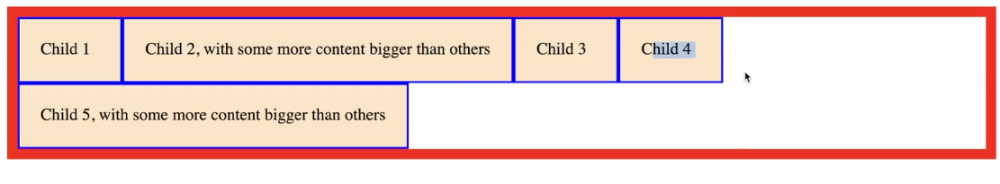
```css
html {
    box-sizing: border-box;
}
*, *:before, *:after {
    box-sizing: inherit;
}
#parent {
    /* flex container */
    border: solid red 10px;
    display: flex;
    flex-direction: row;
    flex-wrap: wrap;
}
#parent div {
    /* flex items */
    border: solid blue 2px;
    padding: 20px;
    background-color: bisque;
    min-width: 100px;
}
```

#### Explanation:

- **`html` and Universal Selectors**: 
  - `html` sets the default `box-sizing` to `border-box` for the entire document.
  - `*, *:before, *:after` ensures all elements and their pseudo-elements inherit the `box-sizing` value from the `html` element.

- **`#parent` (Flex Container)**:
  - **`border: solid red 10px;`**: Adds a solid red border with a thickness of `10px` to the `#parent` container.
  - **`display: flex;`**: Turns the `#parent` into a Flexbox container.
  - **`flex-direction: row;`**: Specifies the main axis direction as horizontal (`row`).
  - **`flex-wrap: wrap;`**: Enables wrapping of flex items onto multiple lines.

- **`#parent div` (Flex Items)**:
  - **`border: solid blue 2px;`**: Adds a solid blue border with a thickness of `2px` to each `div` inside the `#parent`.
  - **`padding: 20px;`**: Provides `20px` padding around the content of each `div`.
  - **`background-color: bisque;`**: Sets the background color of each `div` to bisque.
  - **`min-width: 100px;`**: Specifies the minimum width of each `div` to `100px`.

### Visualization

```
#parent (Flex Container with Wrap Enabled)
+------------------------------------+
|  +--------------+  +--------------+  |
|  |  Flex Item   |  |  Flex Item   |  |
|  +--------------+  +--------------+  |
|  +--------------+  +--------------+  |
|  |  Flex Item   |  |  Flex Item   |  |
|  +--------------+  +--------------+  |
+------------------------------------+
```

### Conclusion

With the corrected CSS code, you have a Flexbox layout where the `#parent` container contains multiple `div` flex items. The `box-sizing` reset ensures consistent box-sizing behavior, and the Flexbox properties enable a flexible and dynamic layout design. You can further customize this basic setup to meet your specific design requirements by adjusting the Flexbox properties and styles.

<br/>
<br/>
<br/>

## We've grasped the concept of `flex-wrap` correctly. Let's elaborate a bit more on these two behaviors:

### `flex-wrap: wrap;`

When `flex-wrap: wrap;` is set, flex items will be allowed to wrap onto the next line or row if they can't fit within the current container's width. This behavior allows the layout to be more flexible, accommodating varying content sizes without causing overflow or distortion.

### `flex-wrap: nowrap;`

Contrastingly, when `flex-wrap: nowrap;` is applied, flex items will attempt to fit within the container's width on a single line. If the combined width of the flex items exceeds the container's width, the items may overflow, potentially causing horizontal scrolling or clipping.

### Visualization

#### `flex-wrap: wrap;`

```
#parent (Flex Container with Wrap Enabled)
+------------------------------------+
|  +--------------+  +--------------+  |
|  |  Flex Item   |  |  Flex Item   |  |
|  +--------------+  +--------------+  |
|  +--------------+                    |
|  |  Flex Item   |                    |
|  +--------------+                    |
+------------------------------------+
```

#### `flex-wrap: nowrap;`

```
#parent (Flex Container with No Wrap)
+------------------------------------+
|  +--------------+  +--------------+  +--------------+  |
|  |  Flex Item   |  |  Flex Item   |  |  Flex Item   |  |
|  +--------------+  +--------------+  +--------------+  |
+------------------------------------+
```

### Conclusion

- **`flex-wrap: wrap;`**: Provides a flexible layout by allowing flex items to wrap onto the next line when they exceed the container's width, ensuring no content is cut off or hidden.
  
- **`flex-wrap: nowrap;`**: Forces all flex items to fit within the container's width on a single line, potentially causing overflow if the items exceed the container's width.

Understanding these behaviors helps in creating adaptive and responsive layouts, ensuring content is displayed appropriately across various screen sizes and devices.

<br/>
<br/>
<br/>

# **`Main Axis`** and **`Cross Axis`**
In Flexbox, understanding the main axis and cross axis is crucial as they determine the direction in which flex items are laid out and aligned within the flex container.

### Main Axis

The main axis is determined by the `flex-direction` property set on the flex container. The main axis can be horizontal or vertical.

- **Horizontal Main Axis (`flex-direction: row;`)**:
  - The main axis runs horizontally from left to right.
  - Flex items are laid out in a row.

- **Vertical Main Axis (`flex-direction: column;`)**:
  - The main axis runs vertically from top to bottom.
  - Flex items are laid out in a column.

### Cross Axis

The cross axis is perpendicular to the main axis.

- **Horizontal Main Axis**:
  - The cross axis runs vertically from top to bottom.
  - Flex items' alignment properties like `align-items`, `align-self`, and `align-content` control the positioning of items along the cross axis.

- **Vertical Main Axis**:
  - The cross axis runs horizontally from left to right.
  - Flex items' alignment properties like `justify-content` and `justify-items` control the positioning of items along the cross axis.

### Visualization

#### Horizontal Main Axis (`flex-direction: row;`)

```
#parent (Main Axis: Horizontal)
+------------------------------------+
|  +--------------+  +--------------+  |
|  |  Flex Item   |  |  Flex Item   |  |
|  +--------------+  +--------------+  |
+------------------------------------+
         Cross Axis (Vertical)
```

#### Vertical Main Axis (`flex-direction: column;`)

```
#parent (Main Axis: Vertical)
+--------------+
|  +----------+  |
|  | Flex Item|  |
|  +----------+  |
|  +----------+  |
|  | Flex Item|  |
|  +----------+  |
+--------------+
       Cross Axis (Horizontal)
```

### Conclusion

- **Main Axis**: Determines the primary direction of flex item layout (`row` for horizontal or `column` for vertical).
  
- **Cross Axis**: Runs perpendicular to the main axis and is used for aligning flex items within the flex container.

Understanding these axis concepts allows you to effectively use Flexbox properties to control the layout and alignment of flex items, creating versatile and responsive designs across different screen sizes and orientations.

<br/>
<br/>
<br/>

##  Let's delve deeper into the `justify-content` property in Flexbox, taking into consideration both the main axis and cross axis.

### `justify-content`

The `justify-content` property aligns flex items along the main axis of the flex container. It controls how flex items distribute space along the main axis, providing different alignment options to position items within the container.

### Alignment Values

- **`flex-start`** (Default):
  - Aligns items at the start of the container's main axis.
  - For a horizontal main axis, it aligns items to the left.
  - For a vertical main axis, it aligns items to the top.
  - 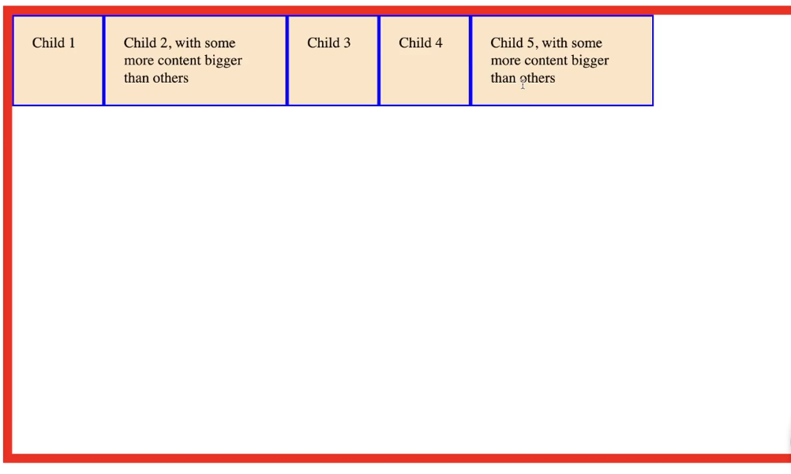

- **`flex-end`**:
  - Aligns items at the end of the container's main axis.
  - For a horizontal main axis, it aligns items to the right.
  - For a vertical main axis, it aligns items to the bottom.
  - 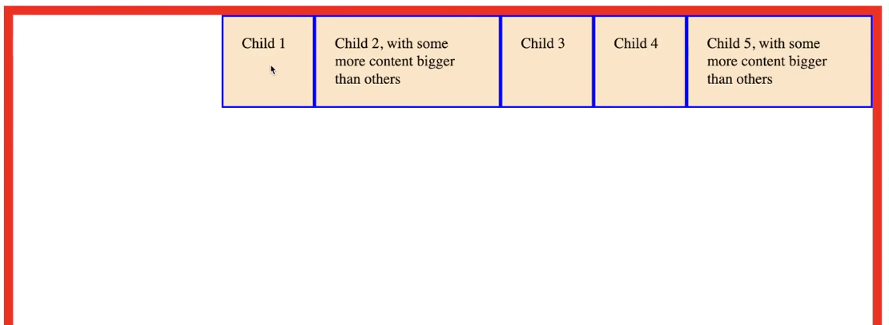


- **`center`**:
  - Centers items along the container's main axis.
  - Flex items are evenly distributed with equal space before the first item and after the last item.
  - 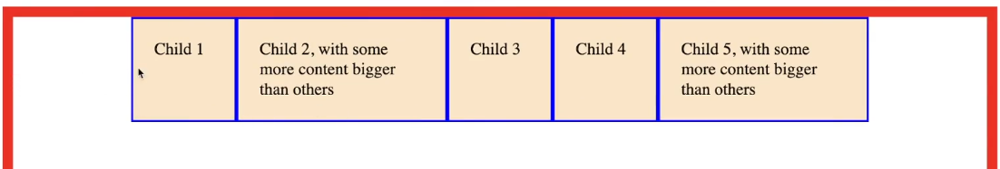

- **`space-between`**:
  - Distributes items evenly along the main axis.
  - The first item is at the start, the last item is at the end, and the remaining items are evenly spaced in between.
  - 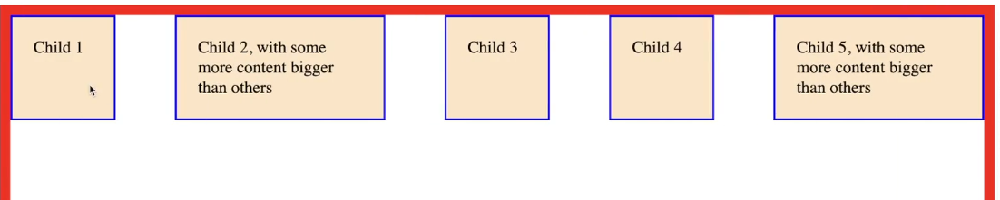

- **`space-around`**:
  - Distributes items evenly along the main axis with equal space around them.
  - Items have equal space before, between, and after them. ie 10 px left,right
  - 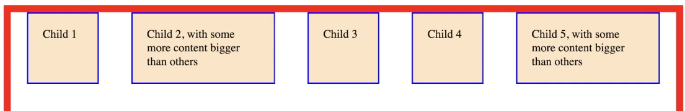

- **`space-evenly`**:
  - Distributes items evenly along the main axis with equal space between them, including before the first item and after the last item.
  - 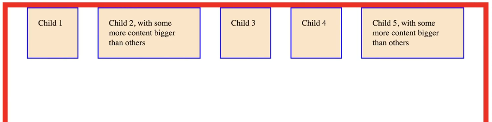

### Consideration of Main Axis

The alignment values of `justify-content` apply along the main axis of the flex container.

#### Horizontal Main Axis (`flex-direction: row;`)

- **`flex-start`**: Aligns items to the left.
- **`flex-end`**: Aligns items to the right.
- **`center`**: Centers items horizontally.
- **`space-between`**: Distributes items with no space at the start and end.
- **`space-around`**: Distributes items with space before, between, and after them.
- **`space-evenly`**: Distributes items with equal space between them.

#### Vertical Main Axis (`flex-direction: column;`)

- **`flex-start`**: Aligns items to the top.
- **`flex-end`**: Aligns items to the bottom.
- **`center`**: Centers items vertically.
- **`space-between`**: Distributes items with no space at the top and bottom.
- **`space-around`**: Distributes items with space above, between, and below them.
- **`space-evenly`**: Distributes items with equal space between them, including at the top and bottom.

### Visualization

#### Horizontal Main Axis (`flex-direction: row;`)

```
#parent (Main Axis: Horizontal)
+------------------------------------+
|  +----+  +----+  +----+  +----+  +----+  |
|  |Item|  |Item|  |Item|  |Item|  |Item|  |
|  +----+  +----+  +----+  +----+  +----+  |
+------------------------------------+
```

#### Vertical Main Axis (`flex-direction: column;`)

```
#parent (Main Axis: Vertical)
+----+
|Item|
+----+
|Item|
+----+
|Item|
+----+
|Item|
+----+
|Item|
+----+
```

### Conclusion

`justify-content` is a powerful Flexbox property that allows you to control the alignment and spacing of flex items along the main axis of the flex container. By understanding the main axis and the available alignment values, you can create flexible and responsive layouts that adapt to different content sizes and screen dimensions, enhancing the overall design and user experience.

<br/>
<br/>
<br/>

# Flexbox Froggy Game for Flex
[Flexbox Froggy](https://flexboxfroggy.com/) is an interactive game designed to help you learn and practice the basics of Flexbox through fun and engaging challenges. The game provides a visual representation of a pond with lily pads that represent flex items. Your goal is to move the frogs (flex items) to their respective lily pads using various Flexbox properties.

### How to Play Flexbox Froggy

1. **Visit the Website**: Go to [Flexbox Froggy](https://flexboxfroggy.com/) to start the game.

2. **Select a Level**: You can start from the first level and progress through each level, or you can select a specific level to practice.

3. **Read the Challenge**: Each level presents you with a specific Flexbox challenge that you need to solve.

4. **Write CSS**: Use the provided CSS editor to write the correct Flexbox properties that will move the frogs to their lily pads.

5. **Test Your Solution**: Click the "Run" button to test your CSS solution. If the frogs move to their correct positions, you've solved the challenge!

6. **Advance to Next Level**: Once you solve a level, you can proceed to the next level to take on more complex challenges and learn additional Flexbox properties.

### Key Flexbox Properties Covered

- `justify-content`
- `align-items`
- `flex-direction`
- `order`
- `align-self`
- `flex-wrap`
- `flex-flow`

### Benefits

- **Interactive Learning**: Flexbox Froggy makes learning Flexbox interactive and enjoyable, helping you grasp concepts more effectively.
  
- **Real-Time Feedback**: Receive immediate feedback on your solutions, allowing you to learn from mistakes and improve your understanding of Flexbox properties.
  
- **Progressive Difficulty**: The game offers increasing levels of difficulty, allowing you to build upon your knowledge and skills as you progress.

### Conclusion

Flexbox Froggy is a fantastic resource for anyone looking to learn Flexbox or sharpen their skills. Whether you're a beginner or an experienced developer, the game offers a fun and interactive way to master Flexbox layout techniques. So hop on over to Flexbox Froggy and start mastering Flexbox through playful challenges!

<br/>
<br/>
<br/>

# `align-items`

The `align-items` property defines how flex items are aligned along the cross axis of the flex container. It controls the vertical alignment for a horizontal main axis (`flex-direction: row;`) and the horizontal alignment for a vertical main axis (`flex-direction: column;`).

### Alignment Values

- **`flex-start`**:
  - Aligns items at the start of the cross axis.
  - For a horizontal main axis, it aligns items to the top.
  - For a vertical main axis, it aligns items to the left.
  - 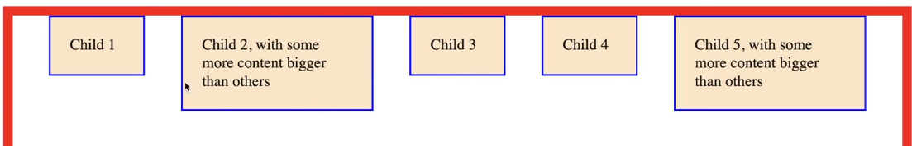

- **`flex-end`**:
  - Aligns items at the end of the cross axis.
  - For a horizontal main axis, it aligns items to the bottom.
  - For a vertical main axis, it aligns items to the right.
  - 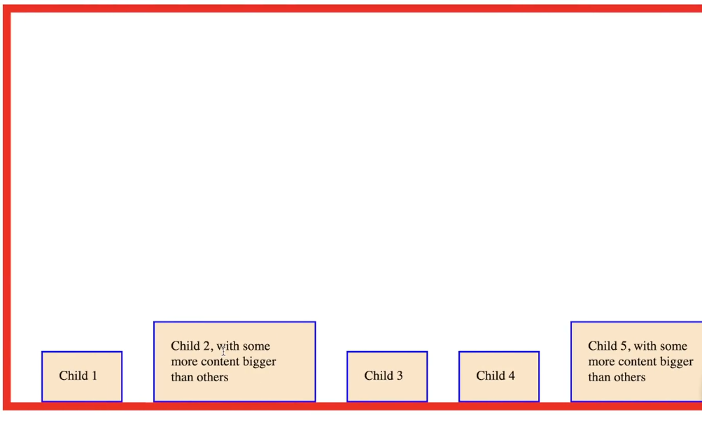

- **`center`**:
  - Centers items along the cross axis.
  - Flex items are evenly centered within the flex container.
  - 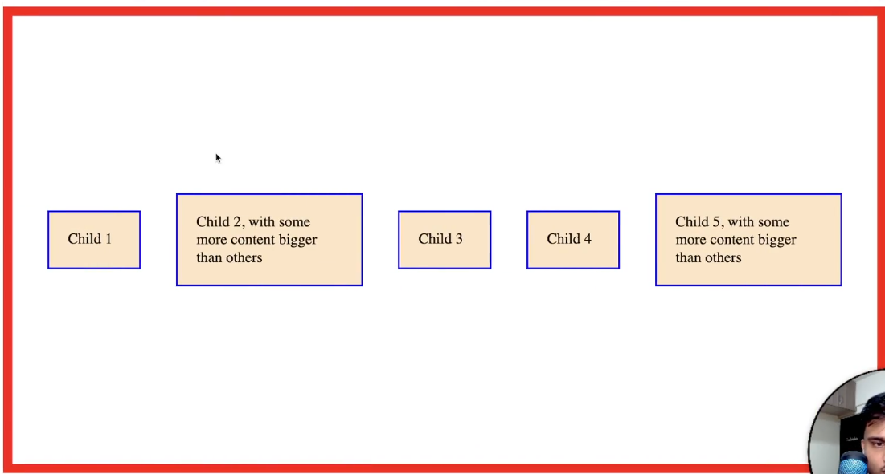

- **`baseline`**:
  - Aligns items by their baselines.
  - Useful when flex items have varying text sizes, aligning their baselines for a consistent appearance.

- **`stretch`** (Default):
  - Stretches items to fill the container along the cross axis.
  - Flex items will stretch to match the height (for a horizontal main axis) or width (for a vertical main axis) of the flex container.
  - 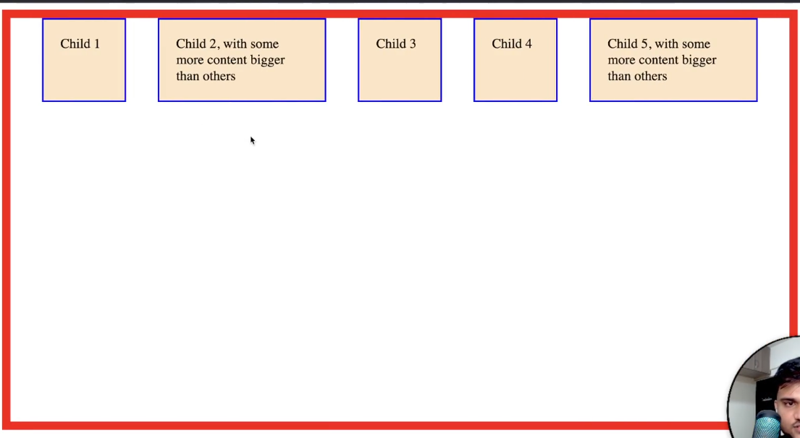

### Consideration of Cross Axis

The alignment values of `align-items` apply along the cross axis of the flex container.

#### Horizontal Main Axis (`flex-direction: row;`)

- **`flex-start`**: Aligns items to the top.
- **`flex-end`**: Aligns items to the bottom.
- **`center`**: Centers items vertically.
- **`baseline`**: Aligns items by their baselines.
- **`stretch`**: Stretches items to fill the container's height.

#### Vertical Main Axis (`flex-direction: column;`)

- **`flex-start`**: Aligns items to the left.
- **`flex-end`**: Aligns items to the right.
- **`center`**: Centers items horizontally.
- **`baseline`**: Aligns items by their baselines.
- **`stretch`**: Stretches items to fill the container's width.

### Visualization

#### Horizontal Main Axis (`flex-direction: row;`)

```
#parent (Main Axis: Horizontal)
+------------------------------------+
|  +----+  +----+  +----+  +----+  +----+  |
|  |Item|  |Item|  |Item|  |Item|  |Item|  |
|  +----+  +----+  +----+  +----+  +----+  |
+------------------------------------+
      Cross Axis (Vertical Alignment)
```

#### Vertical Main Axis (`flex-direction: column;`)

```
#parent (Main Axis: Vertical)
+----+
|Item|
+----+
|Item|
+----+
|Item|
+----+
|Item|
+----+
|Item|
+----+
      Cross Axis (Horizontal Alignment)
```

### Conclusion

`align-items` is a fundamental Flexbox property that allows you to control the alignment of flex items along the cross axis of the flex container. Understanding the relationship between the main axis and the cross axis, along with the available alignment values, empowers you to create versatile and visually appealing layouts that adapt to different content and design requirements.

<br/>
<br/>
<br/>

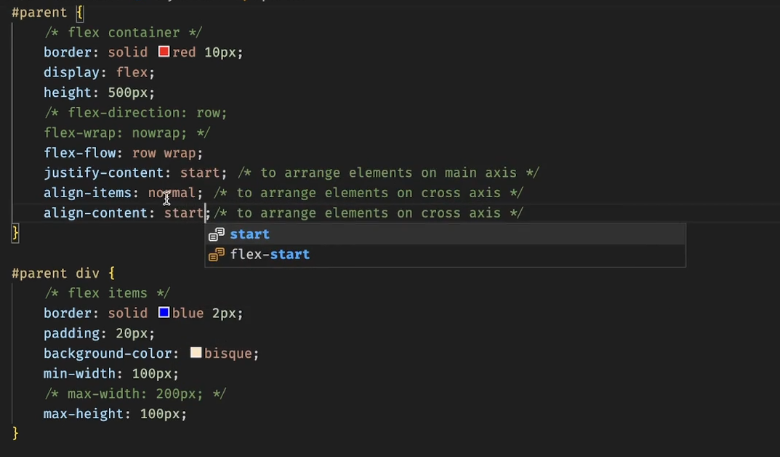

# `align-content`

The `align-content` property controls the alignment of flex lines within the flex container when there is extra space in the cross axis. This property has an effect only when there are multiple lines of flex items within the flex container, and the flex container has extra space in the cross axis.

### Alignment Values

- **`flex-start`**:
  - Aligns flex lines at the start of the cross axis.
  - The first line of flex items will be at the beginning of the cross axis.
  - 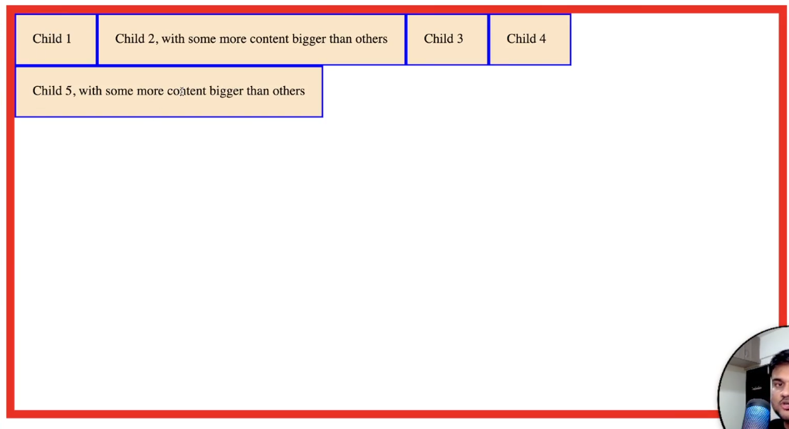

- **`flex-end`**:
  - Aligns flex lines at the end of the cross axis.
  - The last line of flex items will be at the end of the cross axis.
  - 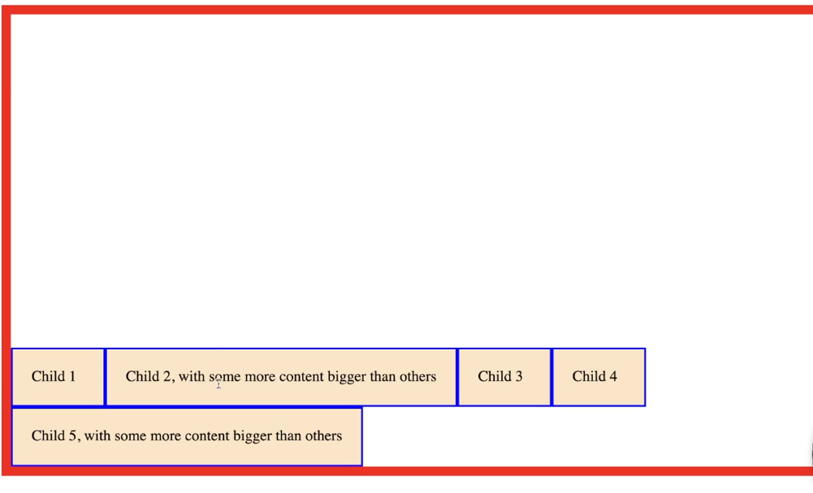

- **`center`**:
  - Centers flex lines along the cross axis.
  - Flex lines are evenly centered within the flex container.

- **`space-between`**:
  - Distributes space evenly between flex lines.
  - The first line is at the start, the last line is at the end, and the remaining lines have equal space between them.
  - 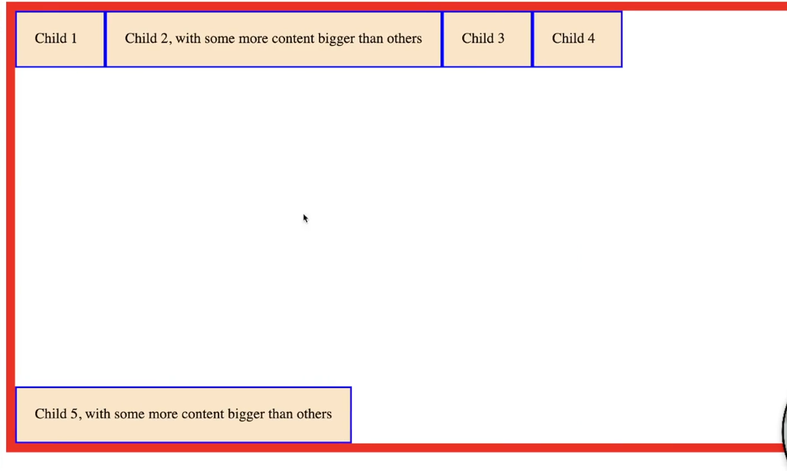

- **`space-around`**:
  - Distributes space evenly around flex lines.
  - Space is evenly distributed before the first line, between lines, and after the last line.

- **`space-evenly`**:
  - 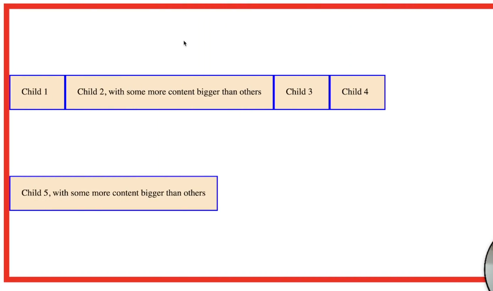

- **`stretch`** (Default):
  - Stretches flex lines to fill the container's cross axis.
  - Flex lines will stretch to match the height (for a horizontal main axis) or width (for a vertical main axis) of the flex container.

### Visualization

#### Horizontal Main Axis with Multiple Lines

```
#parent (Main Axis: Horizontal, Multiple Lines)
+------------------------------------+
|  +----+  +----+  +----+  +----+  +----+  |
|  |Item|  |Item|  |Item|  |Item|  |Item|  |
|  +----+  +----+  +----+  +----+  +----+  |
|  +----+  +----+  +----+  +----+          |
|  |Item|  |Item|  |Item|  |Item|          |
|  +----+  +----+  +----+  +----+          |
+------------------------------------+
     Cross Axis (Vertical Alignment)
```

#### Vertical Main Axis with Multiple Lines

```
#parent (Main Axis: Vertical, Multiple Lines)
+----+  +----+  +----+  +----+
|Item|  |Item|  |Item|  |Item|
+----+  +----+  +----+  +----+
|Item|  |Item|  |Item|  |Item|
+----+  +----+  +----+  +----+
          Cross Axis (Horizontal Alignment)
```

### Conclusion

- **`align-content`** is used to control the alignment of flex lines within a flex container.
  
- The property's effect is noticeable when the container has extra space in the cross axis, allowing you to adjust the spacing and positioning of multiple lines of flex items.

- By understanding the `align-content` property and its alignment values, you can create more complex and responsive layouts with Flexbox, accommodating varying content sizes and adapting to different design requirements.

<br/>
<br/>
<br/>

# Summary of Flexbox Alignment Properties: `justify-content`, `align-items`, and `align-content`

Here's a concise conclusion on when to use `justify-content`, `align-items`, and `align-content` in Flexbox:

- **`justify-content`**: 
  - Use this property to align flex items along the main axis of the flex container.
  - Choose from values like `flex-start`, `flex-end`, `center`, `space-between`, `space-around`, and `space-evenly` to control the horizontal or vertical alignment of flex items within the container.

- **`align-items`**: 
  - Use this property to align flex items along the cross axis of the flex container.
  - Select from values like `flex-start`, `flex-end`, `center`, `baseline`, and `stretch` to control the vertical or horizontal alignment of flex items.

- **`align-content`**: 
  - Use this property to align multiple lines of flex items within the flex container's cross axis when there's extra space.
  - Opt for values like `flex-start`, `flex-end`, `center`, `space-between`, `space-around`, and `stretch` to adjust the spacing and positioning of flex lines.

### Summary:

- **`justify-content`** for aligning items along the main axis.
- **`align-items`** for aligning items along the cross axis.
- **`align-content`** for controlling spacing between multiple lines of items on the cross axis.


<br/>
<br/>
<br/>

# Understanding Flex-Basis and Flex-Grow in Flexbox Layouts

Flexbox provides two essential properties, `flex-basis` and `flex-grow`, that play crucial roles in determining the size and flexibility of flex items within a flex container. Let's delve into these properties in detail.

#### `flex-basis`

The `flex-basis` property specifies the initial main size (width for a horizontal layout or height for a vertical layout) of a flex item before any free space is distributed according to the `flex-grow` and `flex-shrink` properties.

- **Values**: 
  - **Length Values**: You can specify the initial size using length values like `px`, `em`, `rem`, `%`, etc.
  - **Content**: You can use `content` to set the size based on the content's size.
  - **Auto**: Default value that allows the browser to calculate the initial size based on the content.


#### `flex-grow`

The `flex-grow` property defines how much a flex item should grow relative to other flex items when there's extra space available in the flex container.

- **Values**: 
  - **Number**: A positive number indicating the flex grow factor.
  - **Default**: Default value is `0`, meaning the item will not grow.

### How They Work Together

- **Without `flex-basis`**:
  - If `flex-basis` is not set, the initial size is determined by the content or the default size of the flex item.
  - `flex-grow` alone will determine how items grow relative to each other when extra space is available.

- **With `flex-basis`**:
  - `flex-basis` sets the initial size of the flex item.
  - `flex-grow` determines how much the item grows relative to others when extra space is available.

### Examples

#### Using `flex-basis` with `flex-grow`

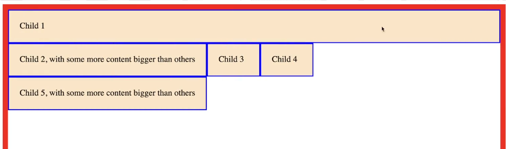
```css
.item {
  flex-basis: 100px;  /* Initial size */
}
```


```css
.item {
    flex-basis: 100px;  /* Initial size */
  flex-grow: 1;       /* Allows item to grow */
}
```

#### Using `flex-grow` without `flex-basis`
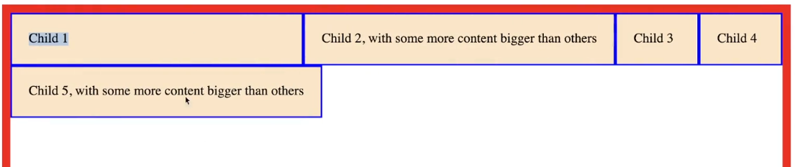
```css
.item {
  flex-grow: 1;       /* Allows item to grow */
}
```

### Conclusion

- **`flex-basis`** sets the initial size of a flex item.
- **`flex-grow`** defines the ability of a flex item to grow when there's extra space available.

By understanding and utilizing `flex-basis` and `flex-grow` effectively, you can create flexible and responsive layouts that adapt to varying content sizes and optimize space distribution within flex containers.

<br/>
<br/>
<br/>

# Exploring Gradients in CSS: Linear and Radial Gradients

Gradients in CSS allow you to create smooth transitions between two or more specified colors, providing a dynamic and visually appealing background or border effect for elements. Let's delve into the details of linear and radial gradients, the two main types of gradients available in CSS.

#### Linear Gradients

Linear gradients create a transition effect between two or more colors along a straight line.

##### Syntax:

```css
/* Linear Gradient */
background-image: linear-gradient(direction, color-stop1, color-stop2, ...);
```

- **`direction`**: Optional. Defines the direction of the gradient line (`to bottom`, `to top`, `to left`, `to right`, `to bottom left`, etc.).
  
- **`color-stop`**: Specifies the color and position of the gradient stop.

##### Examples:

```css
/* Vertical Gradient */
.element {
  background-image: linear-gradient(to bottom, red, yellow);
}

/* Diagonal Gradient */
.element {
  background-image: linear-gradient(to bottom right, red, yellow);
}

/* Multiple Colors with Positions */
.element {
  background-image: linear-gradient(to right, red 0%, blue 50%, green 100%);
}
```

#### Radial Gradients

Radial gradients create a transition effect between two or more colors radiating from a center point outward or along a specified shape.

##### Syntax:

```css
/* Radial Gradient */
background-image: radial-gradient(shape size at position, start-color, ..., last-color);
```

- **`shape`**: Defines the shape of the gradient (`circle`, `ellipse`).
  
- **`size`**: Defines the size of the gradient (`closest-side`, `farthest-side`, `closest-corner`, `farthest-corner`).

- **`position`**: Defines the position of the center of the gradient.

##### Examples:

```css
/* Circle Gradient */
.element {
  background-image: radial-gradient(circle, red, yellow);
}

/* Elliptical Gradient */
.element {
  background-image: radial-gradient(ellipse, red, yellow);
}

/* Position and Size */
.element {
  background-image: radial-gradient(circle closest-corner at 20% 30%, red, blue);
}
```

#### Gradient Properties

You can also combine gradients with other CSS properties for enhanced effects.

- **`background-repeat`**: Specifies how the gradient should repeat.
  
- **`background-position`**: Defines the starting position of the gradient.
  
- **`background-size`**: Specifies the size of the gradient.

##### Example:

```css
/* Combined Gradient with Background Properties */
.element {
  background-image: linear-gradient(to right, red, blue);
  background-repeat: no-repeat;
  background-position: center;
  background-size: cover;
}
```

### Conclusion

- **Linear and Radial Gradients** in CSS enable the creation of smooth color transitions for backgrounds and borders.
  
- **Linear Gradients** transition colors along a straight line with specified direction and color stops.
  
- **Radial Gradients** radiate colors from a center point or shape with defined size and position.

By mastering the use of gradients in CSS, you can add depth, dimension, and visual interest to your web designs, enhancing the overall user experience and aesthetics of your websites and applications.

<br/>
<br/>
<br/>

# **`CSSGradient.io`**
[CSS Gradient](https://cssgradient.io/) is a popular online tool that allows you to generate custom gradients with ease. It provides a user-friendly interface where you can visually create, customize, and preview linear and radial gradients, enabling you to find the perfect gradient for your web projects.

### Key Features:

1. **Visual Gradient Editor**: 
   - Drag and drop color stops to create custom gradients.
   - Preview changes in real-time as you adjust colors and positions.

2. **Gradient Types**:
   - Create both linear and radial gradients.
   - Customize gradient direction, angle, shape, and size.

3. **Color Formats**:
   - Input colors using HEX, RGB, RGBA, HSL, and HSLA formats.
   - Easily switch between color formats for convenience.

4. **Copy Gradient Code**:
   - Copy generated CSS code with a single click.
   - Choose from various CSS syntax formats (Standard, SCSS, Less, and more).

5. **Gradient Collections**:
   - Browse and select from a curated collection of popular gradients.
   - Find inspiration from trending gradient designs.

6. **Responsive Design**:
   - Preview gradients on different screen sizes to ensure responsiveness.
   - Optimize gradients for various devices and resolutions.

### How to Use:

1. **Visit the Website**: Navigate to [CSS Gradient](https://cssgradient.io/) to access the tool.
  
2. **Create Your Gradient**: Use the visual editor to design your custom gradient by adding colors, adjusting positions, and setting gradient types.
  
3. **Preview and Customize**: Visualize your gradient and make adjustments as needed to achieve the desired effect.
  
4. **Copy and Implement**: Once satisfied with your gradient design, copy the generated CSS code and paste it into your project.

### Benefits:

- **User-Friendly Interface**: Intuitive design makes it easy for both beginners and experienced developers to create gradients.
  
- **Time-Saving**: Quickly generate custom gradients without manually writing CSS code.
  
- **Versatility**: Create a wide range of gradient effects to suit various design requirements and aesthetics.

### Conclusion:

CSS Gradient is a valuable tool for designers and developers looking to enhance their web projects with visually appealing gradient effects. Whether you're designing a simple background or a complex gradient pattern, CSS Gradient offers the flexibility and customization options to bring your creative vision to life effortlessly.

<br/>
<br/>
<br/>

# Exploring CSS Variables: Custom Properties in CSS

CSS Variables, also known as Custom Properties, introduce a powerful way to define and reuse values throughout your CSS stylesheets. They offer flexibility and maintainability by allowing you to store values in variables and reference them across your stylesheets.

#### Syntax:

```css
/* Declaration */
:root {
  --variable-name: value;
}

/* Usage */
.selector {
  property: var(--variable-name);
}
```

- **`:root`**: Pseudo-class that defines the global scope for CSS variables. Alternatively, you can scope variables to specific elements.

- **`--variable-name`**: Custom property name preceded by two dashes (`--`).

- **`value`**: Value assigned to the variable, which can be any valid CSS value (color, length, string, etc.).

#### Examples:

```css
/* Declaration */
:root {
  --primary-color: #3498db;
  --secondary-color: #e74c3c;
}

/* Usage */
.button {
  background-color: var(--primary-color);
  color: var(--secondary-color);
}
```

### Benefits:

1. **Maintainability**: 
   - Centralize values in variables for easy updates and consistency across stylesheets.

2. **Reusability**: 
   - Use variables across multiple selectors and properties without repetition.

3. **Dynamic Styling**: 
   - Dynamically change variable values using JavaScript to create interactive designs.

4. **Fallback Values**: 
   - Provide fallback values for browsers that do not support CSS variables for enhanced compatibility.

#### Dynamic Styling with JavaScript:

```javascript
// Change CSS variable value dynamically
document.documentElement.style.setProperty('--primary-color', '#2ecc71');
```

### Advanced Features:

1. **Variable Cascading**: 
   - Inherited values allow for cascading behavior similar to other CSS properties.

2. **Variable Interpolation**: 
   - Combine variables to create new values or calculations.

3. **Media Query Support**: 
   - Use variables within media queries for responsive design customization.

#### Example:

```css
/* Variable Interpolation */
:root {
  --base-font-size: 16px;
  --heading-font-size: calc(var(--base-font-size) * 1.5);
}

/* Media Query with Variable */
@media (min-width: 768px) {
  .container {
    padding: var(--base-spacing) var(--heading-font-size);
  }
}
```

### Conclusion:

- **CSS Variables** offer a flexible and efficient way to manage and reuse values in CSS.
  
- By centralizing values in variables, you can streamline your stylesheets, improve maintainability, and create more dynamic and responsive designs.

- Embrace the power of CSS variables to enhance your CSS workflow and elevate the quality and consistency of your web designs.

<br/>
<br/>
<br/>

# Default Margin for Headings: `1em`

In CSS, most web browsers apply a default margin to headings (h1, h2, h3, etc.) for better readability and spacing. The default margin for headings is commonly set to `1em`, which means the margin is equal to the font-size of the element.

#### Example:

```css
/* Default margin for headings */
h1, h2, h3, h4, h5, h6 {
  margin-top: 1em;
  margin-bottom: 1em;
}
```

# `rem` vs `em`

Both `rem` and `em` are relative length units in CSS, but they are calculated differently and serve different purposes. Understanding the difference between `rem` and `em` is essential for creating flexible and maintainable designs.

#### `em` Unit:

- **Relative to the Parent Element**: 
  - `1em` is equal to the font-size of the element itself or the parent element if used for font-size property.
  
- **Cascading**: 
  - `em` values are affected by the cascading nature of CSS, making them context-sensitive.

#### `rem` Unit:

- **Relative to the Root Element**:
  - `1rem` is equal to the font-size of the root element (`html`), which is typically `16px` by default in most browsers.
  
- **Consistent and Predictable**:
  - `rem` values remain consistent throughout the document, providing a more predictable layout.

### Key Differences:

1. **Scope**:
   - `em`: Relative to the parent element.
   - `rem`: Relative to the root element (`html`).

2. **Consistency**:
   - `em`: Context-sensitive and can vary based on nesting.
   - `rem`: Consistent and unaffected by nesting, making it easier to manage.

3. **Accessibility**:
   - `em`: Useful for responsive typography and scaling based on parent elements.
   - `rem`: Ideal for layout and spacing to maintain consistent proportions.

#### Example:

```css
/* Using em for font-size */
.container {
  font-size: 1.5em;  /* 1.5 times the parent font-size */
}

/* Using rem for spacing */
.section {
  padding: 2rem;  /* 32px (2 * 16px) regardless of parent font-size */
}
```

### When to Use Which?

- **`em`**: 
  - Best suited for situations where you want the size to scale based on the parent element, like typography or nested components.

- **`rem`**: 
  - Recommended for layout, spacing, and global sizing to maintain consistent proportions and simplify responsive design.

### Conclusion:

- **Default Margin for Headings**: The default margin for headings is often set to `1em` for spacing and readability.

- **`rem` vs `em`**: 
  - Choose `em` for context-sensitive scaling based on parent elements.
  - Choose `rem` for consistent and predictable sizing across the document.

Understanding the differences and applications of `rem` and `em` units allows you to create more flexible, maintainable, and responsive designs in CSS.


<br/>
<br/>
<br/>

# Algorithm for Adding Vertical Margins

When adding vertical margins to elements in CSS, it's essential to consider how margins collapse, combine, or stack based on the following rules:

1. **Margin Collapsing**:
   - Vertical margins between adjacent elements can collapse into a single margin.
   - The collapsed margin will be equal to the largest of the two margins.

2. **Minimum Margin**:
   - The minimum margin size for an element's margin is `0`.

3. **Nested Elements**:
   - Margins of child elements do not collapse with margins of their parent element.

### Steps to Calculate Vertical Margins:

1. **Initialize Margins**:
   - Start with the initial margin value specified for each element.

2. **Check Adjacent Margins**:
   - Compare the margins of adjacent elements to see if they collapse.
   - If margins collapse, use the largest margin value.

3. **Apply Margins**:
   - Apply the final margin value to the top or bottom of the element based on the context and desired spacing.

#### Example:

```css
/* Initial Margins */
.element1 {
  margin-bottom: 20px;
}

.element2 {
  margin-top: 30px;
}

/* Calculated Margins after Collapsing */
/* Combined Margin: max(20px, 30px) = 30px */

.element1 {
  margin-bottom: 30px; /* Updated margin after collapsing */
}

.element2 {
  margin-top: 0; /* Collapsed margin, no additional margin required */
}
```

### Considerations:

- **Parent-Child Relationship**: 
  - Margins of child elements do not collapse with their parent's margins.

- **Non-Collapsing Scenarios**: 
  - When margins are separated by a non-collapsing element (e.g., border, padding), they do not collapse.

#### Example:

```html
<div class="parent">
  <div class="child"></div>
</div>
```

```css
.parent {
  margin-bottom: 20px;
}

.child {
  margin-top: 30px;
}
```

In this scenario, the margins of `.parent` and `.child` do not collapse because `.child` is nested inside `.parent`.

### Conclusion:

- **Algorithm for Adding Vertical Margins** involves understanding margin collapsing rules, comparing adjacent margins, and applying the appropriate margin value based on the context.
  
- By following these guidelines, you can effectively manage and control vertical spacing between elements in your CSS layouts, ensuring consistent and visually appealing designs.

<br/>
<br/>
<br/>

# Exploring Line Height in CSS

The `line-height` property in CSS controls the amount of space between lines of text within an element. Understanding and properly setting the `line-height` is crucial for improving readability, aesthetics, and user experience on your web pages.

#### Syntax:

```css
/* Global */
body {
  line-height: value;
}

/* Specific Element */
.selector {
  line-height: value;
}
```

- **`value`**: 
  - Numeric value: Multiplier relative to the element's font-size (e.g., `1.5`, `2`).
  - Length value: Fixed spacing in `px`, `em`, `rem`, `%`, etc.
  - Unitless value: Multiplier relative to the element's font-size without units (e.g., `1.5`).

### Key Concepts:

1. **Default Value**:
   - The default value of `line-height` is often `normal`, which is typically equivalent to `1.2` to `1.4` times the font-size, depending on the browser.

2. **Relative vs. Absolute**:
   - **Relative**: Multiplier or unit-based values that scale with the font-size.
   - **Absolute**: Fixed values that do not change with font-size.

#### Examples:

```css
/* Relative Value */
p {
  font-size: 16px;
  line-height: 1.5;  /* 1.5 times 16px = 24px */
}

/* Absolute Value */
h1 {
  line-height: 30px; /* Fixed line height of 30px */
}
```

### Benefits:

1. **Improved Readability**:
   - Proper `line-height` enhances text legibility by providing sufficient spacing between lines.

2. **Aesthetic Appeal**:
   - Adjusting `line-height` can improve the visual harmony and balance of your typography.

3. **Accessibility**:
   - Adequate line spacing can benefit users with visual impairments, making content easier to read.

### Best Practices:

1. **Maintain Proportions**:
   - Maintain consistent `line-height` proportions relative to font-size across different elements for harmonious typography.

2. **Avoid Tight Spacing**:
   - Avoid setting `line-height` too tight, as it can make text harder to read.

3. **Consider Content Type**:
   - Adjust `line-height` based on the content type (e.g., body text, headings) and design requirements.

#### Example:

```css
/* Good Practice */
body {
  font-size: 16px;
  line-height: 1.5;  /* 24px */
}

h1 {
  font-size: 32px;
  line-height: 1.25; /* 40px */
}
```

### Conclusion:

- **Line Height** is a crucial CSS property for controlling the spacing between lines of text, impacting readability, aesthetics, and accessibility.
  
- By understanding the different `line-height` values, applying best practices, and considering the content type, you can create visually appealing and user-friendly typography for your web designs.

<br/>
<br/>
<br/>

# Exploring Lists in CSS

Lists are fundamental elements in web design used to organize and display information in a structured manner. CSS provides extensive styling capabilities to customize the appearance and layout of lists, including unordered lists (`<ul>`), ordered lists (`<ol>`), and list items (`<li>`).

#### Basic List Structure:

```html
<!-- Unordered List -->
<ul>
  <li>Item 1</li>
  <li>Item 2</li>
  <li>Item 3</li>
</ul>

<!-- Ordered List -->
<ol>
  <li>Item 1</li>
  <li>Item 2</li>
  <li>Item 3</li>
</ol>
```

### Styling Unordered Lists (`<ul>`)

#### List Style Type:

```css
/* Default Bullets */
ul {
  list-style-type: disc;
}

/* Custom Bullets */
ul.circle {
  list-style-type: circle;
}

ul.square {
  list-style-type: square;
}

ul.none {
  list-style-type: none;  /* Removes bullets */
}
```

#### List Style Position:

```css
/* Inside Bullets (default) */
ul {
  list-style-position: inside;
}

/* Outside Bullets */
ul {
  list-style-position: outside;
}
```

### Styling Ordered Lists (`<ol>`)

#### List Style Type:

```css
/* Default Numbers */
ol {
  list-style-type: decimal;
}

/* Lowercase Alphabet */
ol.lower-alpha {
  list-style-type: lower-alpha;
}

/* Uppercase Alphabet */
ol.upper-alpha {
  list-style-type: upper-alpha;
}
```

#### List Style Position:

```css
/* Inside Numbers (default) */
ol {
  list-style-position: inside;
}

/* Outside Numbers */
ol {
  list-style-position: outside;
}
```

### Styling List Items (`<li>`)

#### Customizing List Item:

```css
/* Default */
li {
  list-style-type: disc;
}

/* Specific List Item */
li.special {
  list-style-type: square;
}

/* Removing Bullets */
li {
  list-style-type: none;  /* Removes bullets */
}
```

#### Additional Styles:

```css
/* Margin and Padding */
li {
  margin-bottom: 10px;
  padding-left: 20px;
}

/* Text Alignment */
li.centered {
  text-align: center;
}
```

### Nested Lists:

```html
<ul>
  <li>Item 1
    <ul>
      <li>Nested Item 1</li>
      <li>Nested Item 2</li>
    </ul>
  </li>
  <li>Item 2</li>
</ul>
```

### Conclusion:

- **CSS provides extensive styling options** for customizing lists, including `list-style-type`, `list-style-position`, margins, padding, and more.
  
- **Understanding and utilizing these CSS properties** allows you to create visually appealing and well-structured lists that enhance readability and user experience on your web pages.

- **Consider the context** and the type of content when styling lists to ensure they align with your design goals and improve the presentation of information.

<br/>
<br/>
<br/>

# Understanding the `gap` Property in Flexbox

The `gap` property in CSS is used to set the spacing between flex items along the main axis and cross axis in a flex container. It provides a convenient way to add consistent and responsive spacing between flex items without using margin hacks or padding.

#### Syntax:

```css
.container {
  gap: value;
}
```

- **`value`**:
  - Numeric value: Specifies the size of the gap using a length value like `px`, `em`, `rem`, etc.
  - Multiple values: Can specify separate values for row gap and column gap using the `row-gap` and `column-gap` properties respectively.

### Basic Usage:

```css
/* Single Value (Row and Column Gap) */
.container {
  display: flex;
  gap: 20px; /* Sets both row and column gap to 20px */
}
```

### Separate Row and Column Gap:

```css
/* Separate Row and Column Gap */
.container {
  display: flex;
  row-gap: 20px;    /* Row Gap */
  column-gap: 30px; /* Column Gap */
}
```

### Example:

```html
<!DOCTYPE html>
<html lang="en">
<head>
  <meta charset="UTF-8">
  <title>Flexbox Gap Property</title>
  <style>
    .container {
      display: flex;
      gap: 20px;  /* Row and Column Gap */
      background-color: #f2f2f2;
      padding: 20px;
    }

    .item {
      background-color: #3498db;
      padding: 20px;
      text-align: center;
      flex: 1; /* Flexible Item */
    }
  </style>
</head>
<body>

<div class="container">
  <div class="item">Item 1</div>
  <div class="item">Item 2</div>
  <div class="item">Item 3</div>
</div>

</body>
</html>
```

### Key Points:

1. **Consistent Spacing**: 
   - The `gap` property ensures consistent spacing between flex items, simplifying layout design and maintenance.

2. **Responsive Design**:
   - `gap` values can be adjusted using responsive units like `em`, `rem`, `%`, etc., for a more adaptive and responsive design.

3. **Fallbacks**:
   - The `gap` property is supported in modern browsers, but older browsers may require fallback methods like margin or padding.

### Browser Support:

- **Fully Supported**: 
  - Supported in all major modern browsers, including Chrome, Firefox, Safari, and Edge.

### Conclusion:

- **`gap` in Flexbox** is a versatile property that simplifies spacing between flex items, offering a more intuitive and responsive approach to layout design.

- **Adopting `gap`** can streamline your CSS code, improve maintainability, and enhance the visual consistency and flexibility of your web layouts.

<br/>
<br/>
<br/>

# Exploring CSS Media Queries

Media queries in CSS allow you to apply styles based on various device characteristics, such as screen width, height, orientation, and more. This feature plays a crucial role in creating responsive and adaptive web designs that provide an optimal viewing experience across different devices and screen sizes.

#### Syntax:

```css
@media media_type and (media_feature) {
  /* CSS Styles */
}
```

- **`media_type`**: Specifies the type of media (e.g., `screen`, `print`, `all`).
- **`media_feature`**: Condition based on media features (e.g., `max-width`, `min-width`, `orientation`, `resolution`, etc.).

### Common Media Features:

1. **Width and Height**:
   - `min-width`: Minimum width of the viewport.
   - `max-width`: Maximum width of the viewport.
   - `min-height`: Minimum height of the viewport.
   - `max-height`: Maximum height of the viewport.

2. **Orientation**:
   - `orientation: portrait`: Applies styles when the device is in portrait mode.
   - `orientation: landscape`: Applies styles when the device is in landscape mode.

3. **Resolution**:
   - `min-resolution`: Minimum resolution of the device screen.
   - `max-resolution`: Maximum resolution of the device screen.

### Examples:

#### Responsive Layout for Mobile Devices:

```css
/* Styles for Mobile Devices */
@media screen and (max-width: 768px) {
  body {
    font-size: 14px;
  }
  .container {
    width: 100%;
  }
}
```

#### Landscape Mode Styles:

```css
/* Styles for Landscape Mode */
@media screen and (orientation: landscape) {
  .header {
    font-size: 24px;
  }
}
```

#### High-Resolution Devices:

```css
/* Styles for High-Resolution Screens */
@media screen and (min-resolution: 300dpi) {
  img {
    width: 200px;
  }
}
```

### Combining Media Queries:

You can combine multiple media queries using logical operators like `and`, `or`, and `not` to create more complex conditions.

```css
/* Combined Media Queries */
@media screen and (min-width: 768px) and (orientation: landscape) {
  .sidebar {
    display: none;
  }
}
```

### Best Practices:

1. **Mobile-first Approach**: 
   - Start with styles for mobile devices and use `min-width` media queries to add styles for larger screens, ensuring a smooth transition and avoiding redundancy.

2. **Use Logical Operators**:
   - Combine multiple media features and types using logical operators to create adaptive and precise media query conditions.

3. **Test Across Devices**:
   - Always test your responsive designs across various devices and screen sizes to ensure compatibility and optimal user experience.

### Conclusion:

- **CSS Media Queries** are essential tools for creating responsive and adaptive web designs that adapt to different devices and screen sizes.

- **Understanding and utilizing media features** and best practices enables you to craft flexible and user-friendly layouts that provide a consistent and optimized experience across a wide range of devices and resolutions.

<br/>
<br/>
<br/>

# Exploring CSS Animations

CSS animations allow you to create dynamic and engaging visual effects on web pages without relying on JavaScript or external libraries. With CSS animations, you can animate various properties of HTML elements, such as color, size, position, and opacity, to enhance user experience and add interactivity to your web designs.

#### Basic Animation Syntax:

```css
/* Keyframes */
@keyframes animation_name {
  from {
    /* Initial Styles */
  }
  to {
    /* Final Styles */
  }
}

/* Apply Animation */
.element {
  animation-name: animation_name;
  animation-duration: 3s; /* Animation Duration */
  animation-timing-function: ease-in-out; /* Timing Function */
  animation-delay: 1s; /* Delay Before Animation Starts */
  animation-iteration-count: infinite; /* Number of Times Animation Repeats */
  animation-direction: alternate; /* Animation Direction */
  animation-fill-mode: forwards; /* Style Applied After Animation Ends */
}
```

### Keyframe Animation:

- **`@keyframes`**: Defines the animation sequence by specifying the keyframes (start and end points) of the animation.
- **`from`** and **`to`**: Represents the start (`0%`) and end (`100%`) keyframes.

### Animation Properties:

1. **`animation-name`**: Specifies the name of the keyframe animation to be applied.
2. **`animation-duration`**: Sets the duration of the animation.
3. **`animation-timing-function`**: Defines the timing function for the animation (e.g., `ease`, `ease-in`, `ease-out`, `ease-in-out`).
4. **`animation-delay`**: Adds a delay before the animation starts.
5. **`animation-iteration-count`**: Specifies the number of times the animation should repeat (`infinite` for indefinite looping).
6. **`animation-direction`**: Sets the direction of the animation (`normal`, `reverse`, `alternate`, `alternate-reverse`).
7. **`animation-fill-mode`**: Defines the styles applied before and after the animation (`none`, `forwards`, `backwards`, `both`).

### Examples:

#### Fade In Animation:

```css
@keyframes fadeIn {
  from {
    opacity: 0;
  }
  to {
    opacity: 1;
  }
}

.fade-in {
  animation-name: fadeIn;
  animation-duration: 2s;
  animation-fill-mode: forwards;
}
```

#### Rotate Animation:

```css
@keyframes rotate {
  from {
    transform: rotate(0deg);
  }
  to {
    transform: rotate(360deg);
  }
}

.rotate {
  animation-name: rotate;
  animation-duration: 3s;
  animation-iteration-count: infinite;
  animation-timing-function: linear;
}
```

### Advanced Techniques:

1. **Multiple Keyframes**:
   - Define additional keyframes to create more complex animations with multiple steps.

2. **Animation Events**:
   - Utilize JavaScript to detect and handle animation events like `animationstart`, `animationend`, and `animationiteration`.

3. **Performance Optimization**:
   - Be mindful of performance when using complex animations, especially on mobile devices, to ensure smooth rendering and user experience.

### Browser Support:

- **Widely Supported**:
  - CSS animations are supported in all modern browsers, including Chrome, Firefox, Safari, and Edge, with fallback options for older browsers.

### Conclusion:

- **CSS Animations** provide a powerful and flexible way to create dynamic and interactive web experiences using native CSS capabilities.

- **Mastering CSS animation properties and techniques** allows you to craft engaging visual effects, transitions, and animations that enhance usability, interactivity, and aesthetics across various web projects.

<br/>
<br/>
<br/>

# Exploring CSS Translate and Transition

Both `translate` and `transition` are important concepts in CSS that allow you to create smooth and interactive animations and transitions on web pages. While they are related and often used together, they serve different purposes and have distinct properties.

#### CSS Translate:

The `translate()` function in CSS is used to move an element from its current position along the X and/or Y axes. It is commonly used with `transform` property to achieve various animations like sliding, moving, or repositioning elements.

##### Syntax:

```css
/* Translate */
.element {
  transform: translate(x, y);
}
```

- **`x`**: Horizontal translation value (e.g., `10px`, `50%`).
- **`y`**: Vertical translation value (e.g., `10px`, `50%`).

#### Examples:

##### Translate X-axis:

```css
.slide-left {
  transform: translateX(-100px);
}
```

##### Translate Y-axis:

```css
.slide-up {
  transform: translateY(-50%);
}
```

#### CSS Transition:

The `transition` property in CSS allows you to control the duration, timing function, and properties that undergo a change over time. It enables smooth transitions between different states of an element, such as hover effects, color changes, or size adjustments.

##### Syntax:

```css
/* Transition */
.element {
  transition-property: property;
  transition-duration: duration;
  transition-timing-function: timing-function;
  transition-delay: delay;
}
```

- **`property`**: CSS property to transition (e.g., `all`, `color`, `opacity`).
- **`duration`**: Duration of the transition (e.g., `0.3s`, `1s`, `300ms`).
- **`timing-function`**: Timing function for the transition (e.g., `ease`, `ease-in`, `ease-out`, `ease-in-out`).
- **`delay`**: Delay before the transition starts (e.g., `0s`, `0.5s`).

#### Examples:

##### Basic Transition:

```css
.button {
  transition: background-color 0.3s ease-in-out;
}

.button:hover {
  background-color: #3498db;
}
```

##### Multiple Properties:

```css
.box {
  transition: width 0.3s ease-in-out, height 0.3s ease-in-out;
}

.box:hover {
  width: 200px;
  height: 200px;
}
```

### Translate vs. Transition:

- **Translate**: 
  - Used for transforming an element's position.
  - Provides immediate change without smooth transition.
  
- **Transition**: 
  - Used for animating property changes over time.
  - Provides smooth and controlled transitions between different states.

### Combining Translate and Transition:

You can combine `translate` and `transition` to create more complex animations, such as sliding effects, fade-ins, or bouncing effects.

```css
.element {
  transform: translateY(-100%);
  transition: transform 0.5s ease-in-out;
}

.element:hover {
  transform: translateY(0);
}
```

### Conclusion:

- **CSS Translate** allows for immediate positional changes of elements using `transform` functions.
  
- **CSS Transition** provides a smooth and controlled way to animate property changes over time, enhancing user experience and interactivity.

- **Understanding and mastering** both `translate` and `transition` properties enables you to create dynamic and engaging animations and transitions that elevate the design and usability of your web projects.