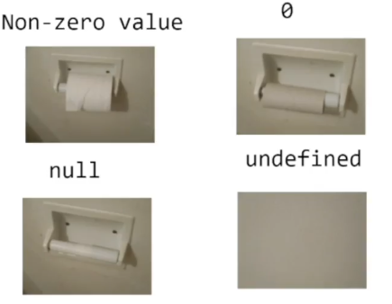

# Introduction to JavaScript:

JavaScript is a high-level, interpreted programming language primarily used for web development. It allows developers to add interactivity and dynamic behavior to websites. JavaScript is commonly used for tasks such as form validation, creating interactive maps, and building web applications.

### Keywords in JavaScript:

Keywords in JavaScript are reserved words that have predefined meanings and cannot be used as identifiers (such as variable names or function names). Here are some of the main keywords in JavaScript:

1. **var, let, const**: Used for declaring variables.
2. **if, else, else if**: Used for conditional statements.
3. **for, while, do-while**: Used for loop iterations.
4. **function**: Used for defining functions.
5. **return**: Used to return a value from a function.
6. **break, continue**: Used to control loop iterations.
7. **switch, case, default**: Used for multi-way branching.
8. **try, catch, finally**: Used for exception handling.
9. **class, extends, super**: Used for object-oriented programming.
10. **this**: Refers to the current object.

### Variables in JavaScript:

Variables are used to store data values in JavaScript. There are three ways to declare variables in JavaScript:

1. **var**: Declares a variable globally, or locally to an entire function regardless of block scope.
   
   ```javascript
   var x = 10;
   ```

2. **let**: Declares a block-scoped variable, only accessible within the block in which it is defined.
   
   ```javascript
   let y = 20;
   ```

3. **const**: Declares a block-scoped constant, which cannot be reassigned a new value.
   
   ```javascript
   const PI = 3.14;
   ```

### Variable Naming Rules:

- Variable names can contain letters, digits, underscores, and dollar signs.
- Variable names cannot begin with a digit.
- Variable names are case-sensitive.
- Avoid using JavaScript reserved words as variable names.

### Example Usage:

```javascript
// Variable declaration
var age = 25;
let name = "John";
const PI = 3.14;

// Conditional statement
if (age >= 18) {
    console.log(name + " is an adult.");
} else {
    console.log(name + " is a minor.");
}

// Function definition
function greet() {
    console.log("Hello, " + name + "!");
}

// Function invocation
greet();
```

### Conclusion:

JavaScript is a versatile language used for both front-end and back-end development. Understanding keywords and variables is essential for writing effective JavaScript code. By mastering these fundamentals, you'll be well on your way to becoming proficient in JavaScript programming.


<br/>
<br/>

# **Displaying Data to Users Using `console.log()` in JavaScript**

Displaying data to users using `console.log()` is a crucial aspect of JavaScript development, aiding in debugging, testing, and providing feedback. Let's delve into the details of how to effectively use `console.log()`.

### Syntax:

```javascript
console.log(data);
```

### Parameters:

- **data**: The data to be displayed. This can be a variable, string, object, array, or any JavaScript expression.

### Usage:

1. **Displaying Variables:**
   
   Log the value of variables to inspect their current state.
   
   ```javascript
   let name = "John";
   let age = 25;
   console.log(name); // Output: John
   console.log(age);  // Output: 25
   ```

2. **Displaying Strings:**
   
   Provide informational messages or debug information by logging string literals.
   
   ```javascript
   console.log("Hello, world!"); // Output: Hello, world!
   ```

3. **Displaying Objects:**
   
   Inspect the properties and values of JavaScript objects by logging them.
   
   ```javascript
   let person = { name: "John", age: 25 };
   console.log(person); // Output: { name: "John", age: 25 }
   ```

4. **Displaying Arrays:**
   
   Log arrays to inspect their contents.
   
   ```javascript
   let numbers = [1, 2, 3];
   console.log(numbers); // Output: [1, 2, 3]
   ```

5. **Displaying Expressions:**
   
   Understand the evaluation of JavaScript expressions by logging their results.
   
   ```javascript
   console.log(5 + 3); // Output: 8
   ```

6. **Formatting Output:**
   
   Format console output using string interpolation or concatenation.
   
   ```javascript
   let a = 5, b = 3;
   console.log(`The sum of ${a} and ${b} is ${a + b}`); // Output: The sum of 5 and 3 is 8
   ```

### Console Methods:

Aside from `console.log()`, the console object offers other useful methods for logging:

- `console.error()`: Outputs an error message.
- `console.warn()`: Outputs a warning message.
- `console.info()`: Outputs an informational message.
- `console.debug()`: Outputs a debug message (depending on browser support).

### Example:

```javascript
let name = "John";
let age = 25;
let person = { name: "John", age: 25 };
let numbers = [1, 2, 3];

console.log("Name:", name);
console.log("Age:", age);
console.log("Person:", person);
console.log("Numbers:", numbers);
console.error("An error occurred!");
console.warn("This is a warning!");
console.info("This is an informational message.");
console.debug("Debug message: ", name);
```

### Output:

```
Name: John
Age: 25
Person: { name: "John", age: 25 }
Numbers: [1, 2, 3]
(index):11 An error occurred!
(index):12 This is a warning!
(index):13 This is an informational message.
```

By effectively using `console.log()`, you can gain insights into your JavaScript code, debug issues, and provide valuable feedback during development.

# **DataTypes in JavaScript: Primitive and Non-Primitives**

In JavaScript, data types can be classified into two main categories: primitive and non-primitive (or reference) types. Let's delve into each category:
### 1. Primitive Data Types:

Primitive data types are immutable, meaning they cannot be altered once created. They directly contain the value. JavaScript has six primitive data types:

1. **Number**: Represents numeric values, including integers and floating-point numbers.
   ```javascript
   let age = 25;
   let pi = 3.14;
   ```

2. **String**: Represents sequences of characters enclosed within single or double quotes.
   ```javascript
   let name = "John";
   ```

3. **Boolean**: Represents a logical value indicating true or false.
   ```javascript
   let isAdult = true;
   ```

4. **Null**: Represents the intentional absence of any value.

   ```javascript
   let result = null;
   ```

5. **Undefined**: Represents a variable that has been declared but not assigned a value.
   ```javascript
   let x;
   ```

6. **Symbol**: Represents unique identifiers. Introduced in ECMAScript 6.
   ```javascript
   const sym = Symbol("description");
   ```

### 2. Non-Primitive (Reference) Data Types:

Non-primitive data types are mutable and are stored by reference. They do not directly contain the value but instead contain a reference to the value's location. The primary non-primitive data type in JavaScript is:

1. **Object**: Represents a collection of key-value pairs, where keys are strings and values can be of any data type.
   ```javascript
   let person = {
       name: "John",
       age: 25,
       isAdult: true
   };
   ```

### Differences:

- **Mutability**: Primitive types are immutable, while non-primitive types are mutable.
- **Storage**: Primitive types directly store the value, while non-primitive types store a reference to the value's location.
- **Pass by Value vs. Pass by Reference**: Primitive types are passed by value, while non-primitive types are passed by reference.

Understanding the distinction between primitive and non-primitive data types is crucial for effective JavaScript programming, especially when working with functions, objects, and data manipulation.

<br/>
<br/>
<br/>

# Special Characters in JavaScript

Special characters in JavaScript play various roles, from representing specific characters to serving as operators or control characters. Let's explore them in detail:

### 1. Special Characters in Strings:

Special characters in strings are used to represent characters that cannot be easily typed or have special meanings. They are represented by escape sequences, starting with a backslash (`\`):

- **\n**: Newline
- **\r**: Carriage return
- **\t**: Tab
- **\b**: Backspace
- **\f**: Form feed
- **\\**: Backslash
- **\'**: Single quote (apostrophe)
- **\"**: Double quote
- **\xhh**: Unicode character with the hexadecimal value `hh`
- **\uhhhh**: Unicode character with the hexadecimal value `hhhh`

Example:
```javascript
console.log("Hello\nWorld"); // Outputs "Hello" on one line, "World" on the next
console.log("Tab\tSeparated"); // Outputs "Tab" separated from "Separated" by a tab
```

### 2. Special Characters in Regular Expressions:

Special characters in regular expressions have special meanings and are used for pattern matching:

- **^**: Matches the beginning of a string.
- **$**: Matches the end of a string.
- **.**: Matches any single character except newline.
- **[]**: Matches any single character within the brackets.
- **|**: Alternation, matches either the expression before or after the pipe.
- **\**: Escapes special characters or introduces special sequences.

Example:
```javascript
let regex = /^Hello/;
console.log(regex.test("Hello, World")); // Outputs true
```

### 3. Special Characters in JavaScript Syntax:

Special characters are also used as operators or symbols in JavaScript syntax:

- **+**: Addition operator.
- **-**: Subtraction operator.
- **\***: Multiplication operator.
- **/**: Division operator.
- **=**: Assignment operator.
- **%**: Modulus operator.
- **&&**: Logical AND operator.
- **||**: Logical OR operator.
- **!**: Logical NOT operator.
- **?:**: Ternary conditional operator.
- **===**: Strict equality operator.

### 4. Unicode Characters:

JavaScript supports Unicode characters, including special characters from different scripts and languages. These characters can be represented using their Unicode code points in escape sequences.

Example:
```javascript
console.log("\u03B1"); // Outputs Greek letter alpha: α
console.log("\u{1F600}"); // Outputs Unicode emoji for grinning face: 😄
```

Understanding special characters in JavaScript is crucial for string manipulation, regular expressions, and general programming tasks. They provide flexibility and power in handling various types of data and patterns.

<br/>
<br/>
<br/>
<br/>


# Comments in JavaScript

Comments in JavaScript are essential for code readability, documentation, and communication among developers. Let's explore them in detail:

### 1. Single-Line Comments:

Single-line comments start with `//` and continue until the end of the line. They are commonly used for brief explanations or annotations:

```javascript
// This is a single-line comment
let name = "John"; // Variable declaration
```

### 2. Multi-Line Comments:

Multi-line comments are enclosed between `/*` and `*/`. They can span across multiple lines and are often used for longer explanations or to comment out blocks of code:

```javascript
/* This is a
multi-line comment */
let age = 25;
```

### 3. Commenting Out Code:

Comments are also useful for temporarily disabling or commenting out code segments during debugging or development:

```javascript
/*
let x = 10;
console.log(x);
*/
```

### 4. Documentation Comments:

Documentation comments, also known as doc comments, are a convention used for documenting functions, methods, classes, and modules. They typically follow a specific format such as JSDoc:

```javascript
/**
 * Adds two numbers together.
 * @param {number} x - The first number.
 * @param {number} y - The second number.
 * @returns {number} The sum of x and y.
 */
function add(x, y) {
    return x + y;
}
```

### 5. Purpose of Comments:

- **Explain Code**: Comments provide explanations for complex or non-obvious parts of the code.
- **TODOs and FIXMEs**: Comments can mark tasks that need to be completed (`TODO`) or issues that need fixing (`FIXME`).
- **Documentation**: Comments help generate documentation for codebases, aiding in understanding and maintaining the code.
- **Disable Code**: Comments temporarily disable code segments during debugging or development.
- **Collaboration**: Comments facilitate communication among team members working on the same codebase.

### Best Practices:

- **Be Descriptive**: Write clear and concise comments that explain the purpose and functionality of the code.
- **Keep Comments Updated**: Ensure that comments remain accurate and relevant as the code evolves.
- **Avoid Overcommenting**: Comments should add value; avoid unnecessary comments that merely repeat the code.
- **Use Meaningful Names**: Prefer meaningful variable, function, and class names over excessive comments.
- **Follow Conventions**: Adhere to established commenting conventions and documentation standards within the project or organization.

Comments are a vital aspect of JavaScript coding practices, promoting code clarity, maintainability, and collaboration among developers.

<br/>
<br/>
<br/>

# **Operators in JavaScript**

Operators in JavaScript are symbols or keywords used to perform operations on operands. They can be unary, binary, or ternary, depending on the number of operands they require. Let's explore them in detail:

### 1. Arithmetic Operators:

Arithmetic operators perform mathematical operations on numeric operands:

- **Addition (+)**: Adds two operands.
- **Subtraction (-)**: Subtracts the second operand from the first.
- **Multiplication (*)**: Multiplies two operands.
- **Division (/)**: Divides the first operand by the second.
- **Modulus (%)**: Returns the remainder of the division of the first operand by the second.
- **Increment (++)**: Increases the value of the operand by 1.
- **Decrement (--)**: Decreases the value of the operand by 1.

Example:
```javascript
let x = 5;
let y = 3;
console.log(x + y); // Output: 8
console.log(x - y); // Output: 2
console.log(x * y); // Output: 15
console.log(x / y); // Output: 1.6666666666666667
console.log(x % y); // Output: 2
```

### 2. Assignment Operators:

Assignment operators are used to assign values to variables:

- **Assignment (=)**: Assigns the value of the right operand to the left operand.
- **Addition Assignment (+=)**: Adds the value of the right operand to the variable and assigns the result to the variable.
- **Subtraction Assignment (-=)**: Subtracts the value of the right operand from the variable and assigns the result to the variable.
- **Multiplication Assignment (*=)**: Multiplies the variable by the value of the right operand and assigns the result to the variable.
- **Division Assignment (/=)**: Divides the variable by the value of the right operand and assigns the result to the variable.
- **Modulus Assignment (%=)**: Computes the modulus of the variable and the right operand and assigns the result to the variable.

Example:
```javascript
let a = 10;
a += 5; // Equivalent to: a = a + 5;
console.log(a); // Output: 15
```

### 3. Comparison Operators:

Comparison operators are used to compare values:

- **Equal to (==)**: Returns true if the operands are equal.
- **Strict equal to (===)**: Returns true if the operands are equal and of the same type.
- **Not equal to (!=)**: Returns true if the operands are not equal.
- **Strict not equal to (!==)**: Returns true if the operands are not equal or not of the same type.
- **Greater than (>)**: Returns true if the left operand is greater than the right operand.
- **Greater than or equal to (>=)**: Returns true if the left operand is greater than or equal to the right operand.
- **Less than (<)**: Returns true if the left operand is less than the right operand.
- **Less than or equal to (<=)**: Returns true if the left operand is less than or equal to the right operand.

Example:
```javascript
let x = 5;
let y = 3;
console.log(x > y); // Output: true
console.log(x === y); // Output: false
```

### 4. Logical Operators:

Logical operators are used to combine or invert boolean values:

- **Logical AND (&&)**: Returns true if both operands are true.
- **Logical OR (||)**: Returns true if at least one of the operands is true.
- **Logical NOT (!)**: Inverts the boolean value of the operand.

Example:
```javascript
let x = true;
let y = false;
console.log(x && y); // Output: false
console.log(x || y); // Output: true
```

### 5. Bitwise Operators:

Bitwise operators perform bit-level manipulation on operands, treating them as sequences of bits:

- **Bitwise AND (&)**: Performs a bitwise AND operation on each pair of corresponding bits.
- **Bitwise OR (|)**: Performs a bitwise OR operation on each pair of corresponding bits.
- **Bitwise XOR (^)**: Performs a bitwise XOR (exclusive OR) operation on each pair of corresponding bits.
- **Bitwise NOT (~)**: Inverts the bits of its operand.
- **Left Shift (<<)**: Shifts the bits of the left operand to the left by the number of positions specified by the right operand.
- **Right Shift (>>)**: Shifts the bits of the left operand to the right by the number of positions specified by the right operand.
- **Zero-Fill Right Shift (>>>)**: Shifts the bits of the left operand to the right by the number of positions specified by the right operand, filling the leftmost bits with zeros.

Example:
```javascript
let x = 5; // Binary representation: 101
let y = 3; // Binary representation: 011
console.log(x & y); // Output: 1 (Binary: 001)
```

### 6. Ternary (Conditional) Operator:

The ternary operator (`? :`) is a conditional operator that evaluates a condition and returns one of two values based on whether the condition is true or false.

Example:
```javascript
let x = 5;
let result = (x > 10) ? "Greater than 10" : "Less than or equal to 10";
console.log(result); // Output: "Less than or equal to 10"
```

Understanding these operators in JavaScript is crucial for writing efficient and expressive code, as they enable various operations and logic flows within your programs.

<br/>
<br/>
<br/>

# **Topic: Short-Circuiting and Coercion in JavaScript**

Short-circuiting and coercion are important concepts in JavaScript that relate to boolean evaluation and type conversion. Let's delve into each of them in detail:

### 1. Short-Circuiting:

Short-circuiting is a behavior in logical expressions where the evaluation of the second operand is skipped if the result can be determined by evaluating the first operand alone.

- **Logical AND (`&&`) Short-Circuiting**: If the first operand is false, the overall result is false, so the second operand is not evaluated.

    ```javascript
    let result = false && someFunction(); // someFunction() is not called
    ```

- **Logical OR (`||`) Short-Circuiting**: If the first operand is true, the overall result is true, so the second operand is not evaluated.

    ```javascript
    let result = true || someFunction(); // someFunction() is not called
    ```

Short-circuiting is often used for conditional logic and to prevent potential errors or unnecessary computations.

### 2. Coercion:

Coercion is the process of converting a value from one data type to another, implicitly or explicitly. JavaScript performs type coercion in various contexts, such as comparisons and arithmetic operations.

- **Explicit Coercion**: Conversion performed explicitly using functions like `parseInt()`, `parseFloat()`, `Number()`, `String()`, etc.

    ```javascript
    let numString = "10";
    let num = Number(numString); // Explicit coercion from string to number
    ```

- **Implicit Coercion**: Automatic conversion performed by JavaScript based on context.

    ```javascript
    let result = "5" + 3; // Implicit coercion: "5" is converted to a number and then added to 3
    console.log(result); // Output: "53"
    ```

    JavaScript uses type coercion to attempt to make sense of operations involving different data types. However, it can lead to unexpected behavior and bugs if not understood properly.

### Examples:

#### Short-Circuiting:

```javascript
// Example of short-circuiting with logical AND (&&)
let isLoggedIn = false;
let userName = isLoggedIn && "John Doe"; // If isLoggedIn is false, userName will be false without evaluating "John Doe"
console.log(userName); // Output: false

// Example of short-circuiting with logical OR (||)
let isAdmin = true;
let accessLevel = isAdmin || "Guest"; // If isAdmin is true, accessLevel will be true without evaluating "Guest"
console.log(accessLevel); // Output: true
```

#### Coercion:

```javascript
// Example of explicit coercion from string to number
let numString = "10";
let num = Number(numString);
console.log(num); // Output: 10

// Example of implicit coercion
let result = "5" + 3; // Implicit coercion: "5" is converted to a number and then added to 3
console.log(result); // Output: "53"
```

Understanding short-circuiting and coercion in JavaScript is crucial for writing concise and effective code, avoiding unexpected behavior, and ensuring code readability and maintainability.


<br/>
<br/>
<br/>

# **Topic: ToBoolean() Conversion in JavaScript**

In JavaScript, the ToBoolean abstract operation is the process of converting a value to a boolean. This conversion occurs implicitly in certain contexts, such as conditional statements and logical expressions. Let's explore ToBoolean conversion in detail:

### 1. Truthy and Falsy Values:

JavaScript defines certain values as "truthy" or "falsy" based on their behavior when coerced to a boolean. These values are crucial in understanding ToBoolean conversion:

- **Truthy Values**: Any value that coerces to true in a boolean context. Examples include non-empty strings, non-zero numbers, objects, arrays, functions, etc.
  
  ```javascript
  if ("Hello") {
      console.log("Truthy value"); // Output: "Truthy value"
  }
  ```

- **Falsy Values**: Any value that coerces to false in a boolean context. Examples include empty strings, zero, null, undefined, NaN, and false itself.
  
  ```javascript
  if (0) {
      console.log("Falsy value");
  } else {
      console.log("Falsy value"); // Output: "Falsy value"
  }
  ```

### 2. ToBoolean Conversion Rules:

ToBoolean conversion in JavaScript follows specific rules to determine whether a value is truthy or falsy:

- **Primitive Values**: All values in JavaScript can be categorized as either truthy or falsy based on predefined rules.
- **Object Values**: All objects (including arrays and functions) are considered truthy regardless of their content.

### 3. ToBoolean Abstract Operation:

The ToBoolean abstract operation explicitly converts a value to a boolean according to the following rules:

- **Undefined**: Converts to false.
- **Null**: Converts to false.
- **Boolean**: Returns the input value (already boolean).
- **Number**: Converts to false if +0, -0, or NaN; otherwise true.
- **String**: Converts to false if the string is empty (""); otherwise true.
- **Object**: Always converts to true.

### Example:

```javascript
console.log(Boolean(undefined)); // Output: false
console.log(Boolean(null)); // Output: false
console.log(Boolean(true)); // Output: true
console.log(Boolean(0)); // Output: false
console.log(Boolean("")); // Output: false
console.log(Boolean("Hello")); // Output: true
console.log(Boolean({})); // Output: true
console.log(Boolean([])); // Output: true
```

### Use Cases:

- **Conditional Statements**: ToBoolean conversion is implicitly performed in if statements, while loops, and other control flow structures.
  
  ```javascript
  let value = "Hello";
  if (value) {
      console.log("Value is truthy"); // Output: "Value is truthy"
  }
  ```

- **Logical Operators**: Logical operators such as && and || rely on ToBoolean conversion to determine their behavior.
  
  ```javascript
  let x = "Hello";
  let y = "";
  console.log(x && y); // Output: ""
  console.log(x || y); // Output: "Hello"
  ```

Understanding ToBoolean conversion is fundamental for writing robust and predictable JavaScript code, especially when dealing with conditional logic and boolean expressions.


<br/>
<br/>
<br/>

# **Topic: Numbers, NaN, Negative Zero, and Negative Infinity in JavaScript**

In JavaScript, numbers are a fundamental data type used to represent numeric values. Additionally, JavaScript includes special numeric values like NaN (Not a Number), negative zero, and negative infinity. Let's explore each of them in detail:

### 1. Numbers:

Numbers in JavaScript represent numeric values, including integers and floating-point numbers. They can be expressed in decimal, hexadecimal, octal, or binary notation:

- **Decimal**: Base 10, e.g., 10, 3.14
- **Hexadecimal**: Base 16, prefixed with `0x`, e.g., 0xFF (255)
- **Octal**: Base 8, prefixed with `0o`, e.g., 0o10 (8)
- **Binary**: Base 2, prefixed with `0b`, e.g., 0b1010 (10)

Example:
```javascript
let integer = 10;
let float = 3.14;
let hex = 0xFF;
let octal = 0o10;
let binary = 0b1010;
```

### 2. NaN (Not a Number):

NaN is a special numeric value representing "Not a Number." It indicates an unrepresentable or undefined value resulting from an invalid operation, such as attempting to perform arithmetic with non-numeric operands or encountering mathematical operations that are undefined.

Example:
```javascript
console.log(0 / 0); // Output: NaN
console.log(parseInt("Hello")); // Output: NaN
```

### 3. Negative Zero:

JavaScript distinguishes between positive zero (`+0`) and negative zero (`-0`). While mathematically equivalent, they have different representations in JavaScript.

Example:
```javascript
console.log(+0 === -0); // Output: true
console.log(1 / +0 === 1 / -0); // Output: false
```

### 4. Negative Infinity:

Negative infinity is a special numeric value representing negative infinity, which is the result of dividing a negative number by zero or when a mathematical operation yields a result less than the minimum representable value.

Example:
```javascript
console.log(1 / 0); // Output: Infinity
console.log(-1 / 0); // Output: -Infinity
```

### Use Cases:

- **Error Handling**: NaN can be used to identify invalid operations or input errors in mathematical calculations.
- **Special Values**: Negative zero and negative infinity provide specific representations for mathematical concepts that are useful in certain contexts, such as computational geometry or physics simulations.

### Considerations:

- **NaN Propagation**: Operations involving NaN typically result in NaN, which can lead to unexpected behavior if not handled properly.
- **Negative Zero**: While rarely encountered, negative zero behaves differently from positive zero in certain edge cases, so it's important to be aware of its existence.

Understanding these special numeric values in JavaScript is crucial for writing robust and error-tolerant code, especially when dealing with mathematical operations and numeric data processing.

<br/>
<br/>
<br/>

# Bitwise Operators in JavaScript

Bitwise operators in JavaScript manipulate the binary representation of numbers at the bit level. They are primarily used for tasks involving binary data, low-level programming, and certain optimizations. Let's explore bitwise operators in detail:

### 1. Bitwise AND (`&`):

The bitwise AND operator (`&`) performs a bitwise AND operation on each pair of corresponding bits in two operands. It returns a 1 in each position where both bits are 1, and 0 otherwise.

```javascript
let result = operand1 & operand2;
```

### 2. Bitwise OR (`|`):

The bitwise OR operator (`|`) performs a bitwise OR operation on each pair of corresponding bits in two operands. It returns a 1 in each position where at least one of the bits is 1.

```javascript
let result = operand1 | operand2;
```

### 3. Bitwise XOR (`^`):

The bitwise XOR (exclusive OR) operator (`^`) performs a bitwise XOR operation on each pair of corresponding bits in two operands. It returns a 1 in each position where the bits differ (one is 0 and the other is 1).

```javascript
let result = operand1 ^ operand2;
```

### 4. Bitwise NOT (`~`):

The bitwise NOT operator (`~`) performs a bitwise NOT operation on each bit of its operand, flipping all the bits. It effectively returns the one's complement of the operand.

```javascript
let result = ~operand;
```

### 5. Left Shift (`<<`):

The left shift operator (`<<`) shifts the bits of the left operand to the left by a specified number of positions. It fills the shifted-in positions with zeros.

```javascript
let result = operand << numBits;
```

### 6. Sign-Propagating Right Shift (`>>`):

The sign-propagating right shift operator (`>>`) shifts the bits of the left operand to the right by a specified number of positions. It preserves the sign of the operand by shifting in copies of the leftmost bit (sign bit).

```javascript
let result = operand >> numBits;
```

### 7. Zero-Fill Right Shift (`>>>`):

The zero-fill right shift operator (`>>>`) shifts the bits of the left operand to the right by a specified number of positions. It fills the shifted-in positions with zeros, regardless of the sign of the operand.

```javascript
let result = operand >>> numBits;
```

### Use Cases:

- **Binary Operations**: Manipulating binary data, such as flags, masks, or bit-packed values.
- **Performance Optimization**: Certain algorithms or operations can be optimized using bitwise operators, especially in low-level programming or when working with large datasets.

### Considerations:

- **Data Representation**: Understanding binary representation and how bitwise operators manipulate it is crucial for correct usage.
- **Signed vs. Unsigned**: Bitwise operators treat operands as signed 32-bit integers, which may affect behavior in certain cases.

Bitwise operators provide a powerful toolset for handling binary data and performing low-level manipulations in JavaScript, offering fine-grained control over individual bits within numbers.

<br/>
<br/>
<br/>

# **Abstract and Equality Operators in JavaScript**

In JavaScript, abstract and equality operators are used to compare values for equality, often in conditional statements or comparisons. Let's delve into them in detail:

### 1. Abstract Equality Comparison (==):

The abstract equality operator (`==`) compares two values for equality after performing type conversion if necessary. It allows values of different types to be compared by attempting to convert them to a common type.

- If the operands have the same type, it behaves like the strict equality operator (`===`).
- If the operands have different types, JavaScript attempts to convert them to numbers, strings, or booleans for comparison.

Example:

```javascript
console.log(5 == "5"); // Output: true (string "5" is converted to number 5 for comparison)
console.log(null == undefined); // Output: true (null and undefined are considered equal)
```

### 2. Strict Equality Comparison (===):

The strict equality operator (`===`) compares two values for equality without performing type conversion. It checks both the value and the type of the operands.

- It returns true if both the value and the type of the operands are the same.
- It returns false if the value or the type of the operands are different.

Example:

```javascript
console.log(5 === "5"); // Output: false (different types)
console.log(null === undefined); // Output: false (different types)
```

### 3. Abstract vs. Strict Equality:

- **Abstract Equality**: Useful for comparing values of different types, but can sometimes lead to unexpected results due to type coercion.
- **Strict Equality**: Preferred for most comparisons as it avoids type coercion and provides predictable results.

### 4. Truthy and Falsy Values:

Both abstract and strict equality operators consider certain values as either "truthy" or "falsy" based on their coercion behavior. Understanding these values is crucial for equality comparisons.

### 5. Object Comparison:

When comparing objects, both abstract and strict equality operators check whether the operands reference the same object in memory. They do not compare the contents of the objects.

### Best Practices:

- **Prefer Strict Equality**: Use strict equality (`===`) by default to avoid unexpected behavior caused by type coercion.
- **Explicit Type Checks**: If necessary, explicitly check for types or use type conversion functions before comparing values.
- **Understand Coercion**: Be aware of how type coercion works in JavaScript and its implications for equality comparisons.

Understanding the nuances between abstract and strict equality operators is crucial for writing robust and predictable JavaScript code, ensuring that comparisons yield the expected results.